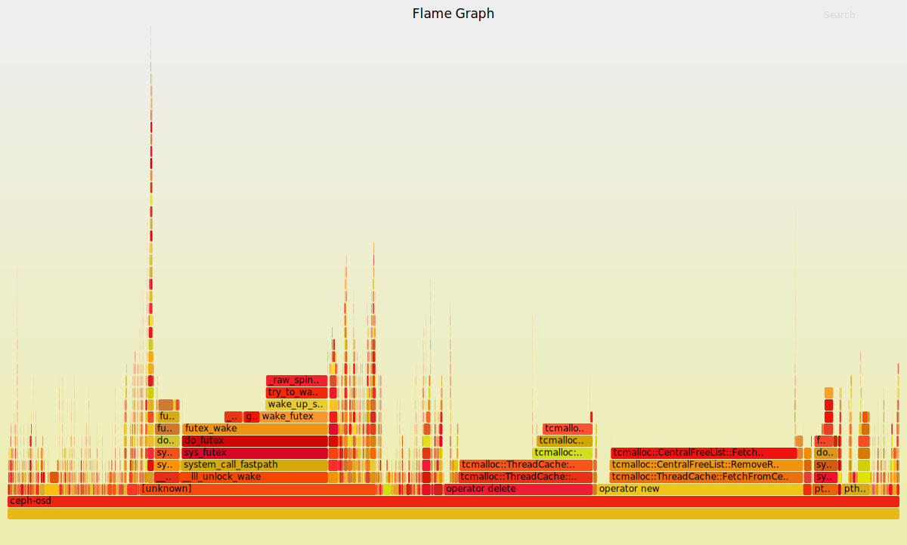
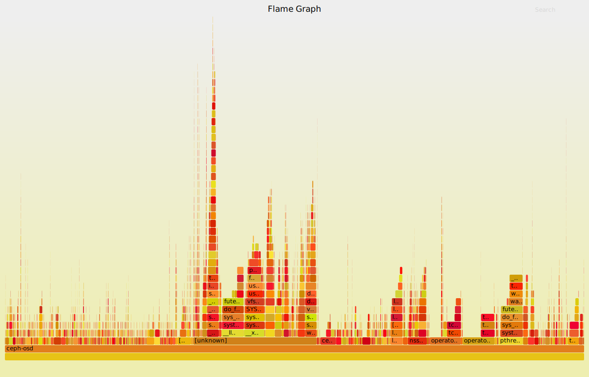

# Ceph

下面步骤是简单的Ceph排查指南，附件是更深入的查看Ceph内部状态的指南。

1. 检查management和storage的网络的健康情况。
2. 使用 ceph -s 命令或者是 ceph health detail命令查看Ceph集群是否有问题。
3. 假如发觉某个OSD有异常，可以通过查看这个osd的日志找出具体原因。
4. 先把所有OSD的osd_op_complaint_time设置为1秒，用于查看是否有slow request。

  ```
  #  for i in `seq 0 20`; do ceph tell osd.$i injectargs --osd_op_complaint_time 1; done
  ```

5. 持续观察ceph的状态，使用 ceph -w 命令查看。
6. 先关闭scrub和deep-scrub，避免scrub对测试产生影响。

  ```
  # ceph osd set noscrub
  # ceph osd set nodeep-scrub
  ```

7. 在你要测试的pool上创建一个10G的rbd image。
8. 使用rbd bench-write直接压测ceph，避免在虚拟机上测试的干扰，并用ceph -w查看集群状态。

  ```
  # 测试4k随机写IOPS
  # rbd -p volumes bench-write zhurongze-test  --io-size 4096 --io-threads 256 --io-total 10737418240 --io-pattern rand
  # 测试128K随机写带宽
  # rbd -p volumes bench-write zhurongze-test  --io-size 131072 --io-threads 256 --io-total  10737418240 --io-pattern rand
  ```

9. 在测试过程中，使用iostat -x -m 1命令查看每个OSD硬盘的await和util，检查是否有异常。
10. 在测试过程中，使用top命令，或者mpstat命令，检查CPU负载情况，查看CPU是否是瓶颈。

  ```
  #mpstat -P ALL  1
  ```

11. 在测试过程中，查看内存使用情况。

## Ceph Debug Tips

#### osd debug 

查看osd配置

  ceph daemon osd.438 config show | less

查看osd性能

```
ceph daemon osd.438 perf dump | less
...
   "filestore": {
        "journal_queue_ops": 0,
        "journal_queue_bytes": 0,
        "op_queue_max_ops": 1000,
        "op_queue_ops": 1000,
        "ops": 5784052,
        "op_queue_max_bytes": 104857600,
        "op_queue_bytes": 6150888,
...
    "osd": {
        "op_wip": 279,
        "op": 3197864,
        "op_in_bytes": 253509575757,
...
    "throttle-osd_client_messages": {
        "val": 329,
        "max": 5000000,
        "get": 3440850,
        "get_sum": 3440850,

重点关注指标
**op_queue_ops**
**op_wip**
**val**(client_messages)
```

查看osd op执行详情

```
ceph daemon osd.438 dump_historic_ops | less
...
               [
                    {
                        "time": "2018-01-31 00:09:44.094935",
                        "event": "initiated"
                    },
                    {
                        "time": "2018-01-31 00:09:44.094962",
                        "event": "queued_for_pg"
                    },
                    {
                        "time": "2018-01-31 00:09:50.467307",
                        "event": "reached_pg"
                    },
                    {
                        "time": "2018-01-31 00:09:50.473305",
                        "event": "waiting for rw locks"
                    },
                    {
                        "time": "2018-01-31 00:09:59.327202",
                        "event": "reached_pg"
                    },
                    {
                        "time": "2018-01-31 00:09:59.467363",
                        "event": "waiting for rw locks"
...
可以发现reached_pg之前，共queue了6s，时间消耗很长
reached_pg之后，等待rw lock消耗了很长时间，怀疑是磁盘性能太差
```

### 集群卡

现象:
ceph集群状态显示正常。
部分虚拟机重启无法进入系统，部分虚拟机IO操作hang住，部分image下载失败。
执行rbd export命令卡住，rados -p images ls卡住。

原因:
J版Ceph有个参数osd_client_message_cap，用于限制client连接数，防止osd占用过多内存，默认值为100。当ceph集群规模较大，在多个client情况下，有可能出现活锁，导致client到该osd的请求连接无法建立，表现为虚拟机IO卡，重启时读取硬盘超时。

```
#ceph -s
#rbd  -p images export 554a5b1e-9634-4025-9865-e85840f96025 ./aaa
#rados -p images ls
# 在ceph.conf中设置debug_ms = 5/5
# 再次执行 rados -p images ls 找出是哪个IP卡住
#ceph osd dump | grep ‘10.125.136.34:6813’
#ceph osd find 312
#systemctl restart ceph-osd@312
```

### slow request

集群出现slow request，先通过日志查看对应的osd。

通过上文的方法分析该osd的请求路径，是否卡在哪一步。

通过脚本获得osd的pg分布（尤其注意是访问哪个pool时出现的slow request，重点关注属于该pool的pg在该osd上的数量）。

由于会存在pg分布不均匀的问题，如果某个pool在该osd上pg过多，会导致这个osd压力过大，从而出现slow request，即出现slow request，不一定就是硬盘物理损坏。

系统安装perf，查看性能瓶颈。比如tcmalloc问题导致的性能下降

```
#获得osd的PID，查看性能消耗在哪一步
# perf top -p PID
#也可以先打压力，然后保存结果查看
# perf record -p PID
# perf report
```

## 修复osd

新建raid0

```
sudo ssacli ctrl slot=0 create type=ld drives=1I:1:13 raid=0
```

先格式化分区

```
sudo dd if=/dev/zero of=/dev/sdf bs=1M count=100
sudo ceph-disk --log-stdout -v zap /dev/sdf
```

准备osd

```
# 找到uuid
ceph osd dump | grep 'osd.680'
# 执行prepare
sudo ceph-disk --log-stdout -v prepare /dev/sdf --osd-uuid 669f35ef-f53f-413f-9bda-e4510dd1adca
```

启动osd

```
# 新盘，需要重新认证
ceph auth del osd.680
# 启动osd
sudo ceph-disk --log-stdout -v activate /dev/sdf1
```

格式化的详细输出

```
[onest@BFJD-PSC-oNest-Sst-SV22 ~]$ sudo ceph-disk --log-stdout -v zap /dev/sdc
get_dm_uuid: get_dm_uuid /dev/sdc uuid path is /sys/dev/block/8:32/dm/uuid
zap: Zapping partition table on /dev/sdc
command_check_call: Running command: /sbin/sgdisk --zap-all -- /dev/sdc
Creating new GPT entries.
GPT data structures destroyed! You may now partition the disk using fdisk or
other utilities.
command_check_call: Running command: /sbin/sgdisk --clear --mbrtogpt -- /dev/sdc
Creating new GPT entries.
The operation has completed successfully.
update_partition: Calling partprobe on zapped device /dev/sdc
command_check_call: Running command: /usr/bin/udevadm settle --timeout=600
command: Running command: /usr/bin/flock -s /dev/sdc /sbin/partprobe /dev/sdc
command_check_call: Running command: /usr/bin/udevadm settle --timeout=600
```

```
949  sudo dd if=/dev/zero of=/dev/sdf bs=1M count=100
 950  sudo ceph-disk --log-stdout -v zap /dev/sdf
 951  sudo ceph-disk --log-stdout -v prepare /dev/sdf --osd-uuid 71dd2628-5c72-47f8-935c-79bf80d36de1
 952  lsblk
 953  sudo ceph-disk --log-stdout -v activate /dev/sdf1
 954  lslk
 955  lsblk
 956  sudo dd if=/dev/zero of=/dev/sdn bs=1M count=100
 957  sudo ceph-disk --log-stdout -v zap /dev/sdn
 958  sudo ceph-disk --log-stdout -v prepare /dev/sdn --osd-uuid 6dbcae9f-861e-4163-9cb5-27fe65097309
 959  sudo ceph-disk --log-stdout -v activate /dev/sdn1
 960  lsblk
 961  sudo dd if=/dev/zero of=/dev/sdr bs=1M count=100
 962  sudo ceph-disk --log-stdout -v zap /dev/sdr
 963  sudo ceph-disk --log-stdout -v prepare /dev/sdr --osd-uuid 7959b57b-9543-4a47-967b-3bf492754a0e
 964  sudo ceph-disk --log-stdout -v activate /dev/sdr1
 965  lsblk
 966  sudo dd if=/dev/zero of=/dev/sdk bs=1M count=100
 967  sudo ceph-disk --log-stdout -v zap /dev/sdk
 968  sudo ceph-disk --log-stdout -v prepare /dev/sdk --osd-uuid 68d5b5fc-606b-4d4e-be6b-a53d6c2be693
 969  sudo ceph-disk --log-stdout -v activate /dev/sdk1
 970  lsblk
 971  sudo ssacli ctrl slot=0 ld all show detail
 972  sudo ssacli ctrl slot=0 ld 11 show detail
 973  sudo [Cumount /var/lib/ceph/osd/ceph-768
 974  sudo umount /var/lib/ceph/osd/ceph-768
 975  sudo ssacli ctrl slot=0 ld 11 delete
 976  sudo ssacli ctrl slot=0 pd all show detail
 977  sudo ssacli ctrl slot=0 create type=ld drives=2I:1:11 raid=0
 978  sudo ssacli ctrl slot=0 ld 11 show detail
 984  lsblk
 ```


 ```
1009  cd zhu/
1010  ceph auth get osd.2
1011  ceph auth get osd.2 > osd.468.keyring
1012  vim osd.468.keyring
1013  sudo ceph -s
1014  ll /etc/ceph/
1015  cat /etc/ceph/ceph.client.admin.keyring
1016  sudo ceph auth get client.admin
1017  sudo ceph auth add osd.468 -i osd.468.keyring
1018  sudo ceph auth get osd.468


26  cat /var/lib/ceph/osd/ceph-468/keyring
27  sudo cat /var/lib/ceph/osd/ceph-468/keyring
28  exit
29  systemctl status ceph-osd@468
30  sudo systemctl restart ceph-osd@468
31  systemctl status ceph-osd@468
 ```


我用  sudo ceph daemon osd.1537 dump_historic_ops 命令把发生slow request的osd的最近最差op dump出来
发现主要是在sub_op_committed和sub_op_applied之间相差很大

```
[onest@BFJD-PSC-oNest-Sst-SV121 ~]$ sudo ceph daemon osd.463  dump_historic_ops
...
"type_data": [
    "started",
    [
        {
            "time": "2016-12-06 23:43:38.753992",
            "event": "initiated"
        },
        {
            "time": "2016-12-06 23:43:38.754194",
            "event": "queued_for_pg"
        },
        {
            "time": "2016-12-06 23:43:38.754874",
            "event": "reached_pg"
        },
        {
            "time": "2016-12-06 23:43:38.754886",
            "event": "started"
        },
        {
            "time": "2016-12-06 23:43:38.757241",
            "event": "commit_queued_for_journal_write"
        },
        {
            "time": "2016-12-06 23:43:38.757296",
            "event": "write_thread_in_journal_buffer"
        },
        {
            "time": "2016-12-06 23:43:38.757687",
            "event": "journaled_completion_queued"
        },
        {
            "time": "2016-12-06 23:43:38.757816",
            "event": "sub_op_committed"
        },
        {
            "time": "2016-12-06 23:43:42.437672",
            "event": "sub_op_applied"
        },
        {
            "time": "2016-12-06 23:43:42.437698",
            "event": "done"
        }
    ]
]
}
]
}

```

## 在ubuntu 14.04给ceph 使用perf 和火焰图

快速使用方法

```
root@node-289:~/zhu# perf record -p 2612463
^C[ perf record: Woken up 40 times to write data ]
[ perf record: Captured and wrote 16.774 MB perf.data (~732860 samples) ]
root@node-289:~/zhu# perf report
root@node-289:~/zhu#
```

安装ceph debuginfo

```
# apt-get install ceph-dbg ceph-common-dbg
```

下载brendan的火焰图生成程序

```
# git clone https://github.com/brendangregg/FlameGraph  
```

记录CPU

```
# perf record -e cpu-clock --call-graph dwarf -p 1857681 -- sleep 30
```

会自动生成 perf.data 文件

```
# perf script | ../FlameGraph/stackcollapse-perf.pl > rgw-perf.out
```

生成火焰图

```
# ../FlameGraph/flamegraph.pl rgw-perf.out > perf-rgw.svg
```

用浏览器打开, 点击具体进程可以查看详情
示例图形
解决tcmalloc问题之前

解决tcmalloc问题之后



## ceph osd near full

1. ceph pg dump > /tmp/ori.pgdump

2. ceph osd df

weight   ...  reweight


3. ceph osd reweight [X] [Y]
OR
ceph osd crush reweight [X] [Y]

4. ceph -s


自动调整osd数据分布
Reweights all the OSDs by reducing the weight of OSDs which are heavily overused. By default it will adjust the weights downward on OSDs which have 120% of the average utilization, but if you include threshold it will use that percentage instead

```
ceph osd reweight-by-utilization
```

## MOS Ceph 替换journal

```
# 停止osd
stop ceph-osd id=50
# 刷新journal到磁盘
ceph-osd --flush-journal -i 50
# 查看journal指向的磁盘
ll
# unlink
unlink journal
ll /dev/disk/by-partuuid/a50517e1-080b-4465-9791-073e2f8506b9
# 用新盘重新link
ln -s /dev/disk/by-partuuid/8b48109d-ee7d-48b3-a31e-0938a8a4e1a5 journal
ceph-osd --mkjournal -i 50
# 启动osd
start ceph-osd id=50
# 清除旧journal数据
dd if=/dev/zero of=/dev/disk/by-partuuid/a50517e1-080b-4465-9791-073e2f8506b9 bs=1M count=100
ll
ll /dev/disk/by-partuuid/8b48109d-ee7d-48b3-a31e-0938a8a4e1a5
# 检查集群状态
ceph -s
lsblk
```

如果需要新建journal分区，操作步骤如下

```
# 查看journal磁盘当前情况
sgdisk --print /dev/sdv
# 根据末位标记新建分区
sgdisk -n 8:0:+10G -c 8:'primary' /dev/sdv
ll /dev/disk/by-partuuid/ | grep sdv8
sgdisk --print /dev/sdv
lsblk
# 通知系统，识别新分区
partprobe /dev/sdv
lsblk
sgdisk --print /dev/sdv
```


ssd 替换journal

ssd使用当前磁盘做journal即可。即在本地创建一个journal文件，作为journal使用。

先保存当前的journal分配信息

```
cd /var/lib/ceph/osd/
for i in `ls .`; do ls -l $i/journal; done > ~/c2-journal
vim ~/c2-journal
ls -l /dev/disk/by-partuuid/ | grep -e 'sdt' -e 'sdu' -e 'sdv' | sort -k 11
ls -l /dev/disk/by-partuuid/ | grep -e 'sdt' -e 'sdu' -e 'sdv' | sort -k 11 >> ~/c2-journal
# 编辑文件，记录当前的journal分配信息
vim ~/c2-journal
lsblk
```

这里ceph-9为ssd类型的osd，之前使用sdv为journal盘，现在替换为本地

```
cd ceph-9
ll
#停止osd，并将journal刷入磁盘
stop ceph-osd id=9
ceph-osd --flush-journal -i 9
ll
unlink journal
#在本地创建2GB的磁盘分区
dd if=/dev/zero of=/var/lib/ceph/osd/ceph-9/journal bs=1M count=2048
ll
ceph-osd --mkjournal -i 9
start ceph-osd id=9
# 清除旧journal的数据
dd if=/dev/zero of=/dev/disk/by-partuuid/d0f88ce2-7c7d-4cd5-9852-f6b839c2e313 bs=1M count=100
ceph -s
```

## ceph动态调整参数，debug

方法一

    ceph tell osd.11 injectargs --debug-osd 5/5

方法二

    ceph daemon osd.11 config set debug_osd 0/0
    ceph daemon /var/run/ceph/ceph-client.rgw.d-m05-mon-01.asok config set debug_rgw 0/0

## fio测试

rbd写满磁盘

```
fio --size=100% --ioengine=rbd --direct=1 --thread=1 --numjobs=1 --rw=write --name=writefile --bs=1m --pool=test --iodepth=200  --direct=1 --sync=0 --randrepeat=0 --refill_buffers --end_fsync=1 --rbdname=1TB_test_image_1 --group_reporting
```

## 创建测试pool，测试osd性能

### 创建单盘osd的pool

先获得当前crushmap

```
root@Ceph-P-1:~# ceph osd getcrushmap -o /tmp/p.bin
got crush map from osdmap epoch 2634
root@Ceph-P-1:~# crushtool -d /tmp/p.bin -o /tmp/p.bin.txt

root@Ceph-P-2:~# ceph osd crush add-bucket only-a-osd root
added bucket only-a-osd type root to crush map
root@Ceph-P-2:~# ceph osd crush add osd.61 1 root=only-a-osd
add item id 61 name 'osd.61' weight 1 at location {root=only-a-osd} to crush map

root@Ceph-P-2:~# ceph osd crush rule create-simple only_a_osd_ruleset only-a-osd osd

root@Ceph-P-1:~# ceph osd crush rm only-a-osd
Error ENOTEMPTY: (39) Directory not empty
root@Ceph-P-1:~# ceph osd crush rm osd.61 only-a-osd
removed item id 61 name 'osd.61' from crush map
root@Ceph-P-1:~# ceph osd tree

root@Ceph-P-1:~# ceph osd crush move osd.61 1 root=only-a-osd
Error EINVAL: (22) Invalid argument
root@Ceph-P-1:~# ceph osd crush create-or-move osd.61 1 root=only-a-osd
create-or-move updating item name 'osd.61' weight 1 at location {root=only-a-osd} to crush map

# root@Ceph-P-1:~# ceph osd crush create-or-move osd.61 1 host=njA-m04-osd-04

root@Ceph-P-1:~# ceph osd pool create a-osd-pool 64 64
pool 'a-osd-pool' created
root@Ceph-P-1:~# ceph osd pool set a-osd-pool size 1
set pool 27 size to 1
root@Ceph-P-1:~# ceph osd pool set a-osd-pool crush_ruleset 1
set pool 27 crush_ruleset to 1
root@Ceph-P-1:~# ceph osd dump  |grep pool

root@Ceph-P-1:~# rbd -p a-osd-pool create --image test_image --size 51200
root@Ceph-P-1:~# rbd -p a-osd-pool create info test_image
rbd: too many arguments
root@Ceph-P-1:~# rbd -p a-osd-pool info test_image
rbd image 'test_image':
        size 51200 MB in 12800 objects
        order 22 (4096 kB objects)
        block_name_prefix: rbd_data.13565574b0dc51
        format: 2
        features: layering, exclusive-lock, object-map, fast-diff, deep-flatten
        flags:
```

### 利用现有crushmap，测试

```
当前crushmap如下
root@njB-m05-mon-01:~/crush# ceph osd tree | grep -v ' up '
ID  WEIGHT     TYPE NAME                       UP/DOWN REWEIGHT PRIMARY-AFFINITY
-16          0 root only-a-hg
 -1 1178.49463 root apple
-14 1178.49463     copy-set cs01
-11  392.83154         host-group m04
 -5  130.94385             host njB-m04-osd-01
 -9  130.94385             host njB-m04-osd-02
 -6  130.94385             host njB-m05-osd-04
-12  392.83154         host-group m05
 -8  130.94385             host njB-m05-osd-01
-10  130.94385             host njB-m05-osd-02
 -4  130.94385             host njB-m05-osd-03
-13  392.83154         host-group m06
 -2  130.94385             host njB-m06-osd-01
 -7  130.94385             host njB-m06-osd-02
 -3  130.94385             host njB-m06-osd-03

root@njB-m05-mon-01:~/crush# ceph osd crush rule create-simple only_a_hg_ruleset m05 host
root@njB-m05-mon-01:~/crush# ceph osd pool create only_a_hg 1024
pool 'only_a_hg' created
root@njB-m05-mon-01:~/crush# ceph osd pool set only_a_hg crush_ruleset 1
set pool 8 crush_ruleset to 1
root@njB-m05-mon-01:~/crush# rbd -p only_a_hg create --image mm --size 900G
root@njB-m05-mon-01:~/crush# rbd -p only_a_hg rm mm
Removing image: 100% complete...done.
root@njB-m05-mon-01:~/crush# ceph osd pool rm only_a_hg only_a_hg --yes-i-really-really-mean-it
pool 'only_a_hg' removed
root@njB-m05-mon-01:~/crush# ceph osd crush rule rm only_a_hg_ruleset
root@njB-m05-mon-01:~/crush# ceph osd crush rule create-simple only_a_hg_ruleset m06 host
```


## 换盘流程

https://mp.weixin.qq.com/s?__biz=MzI0NDE0NjUxMQ==&mid=2651256423&idx=1&sn=b0cc580db2d9c090f96ea46f741fee25&chksm=f2901e47c5e79751b45f9003b9a72629357e7243d5dfcb0570a77fc782f40a2af274e8bd867e&mpshare=1&scene=1&srcid=061968OlUHGz4P8SSIurb1sT&key=2b4a905e8c07cb21bc512fb21bd3ea3e33f1565f18b4a7bd9166803133b0727e8b679329a1a224e09bbe40499af33e8fe029407c35c8ff30e1fe2ad3d1b8475e1ed994df1b592159e3b30417182191b1&ascene=0&uin=MTU1OTUyMzc1&devicetype=iMac+MacBookPro12%2C1+OSX+OSX+10.12.5+build(16F73)&version=12020810&nettype=WIFI&fontScale=100&pass_ticket=IsbxGZXfR2MpL0vfwotdOU%2F%2Fs0Q0bDwBtLhZVkmq9TQ%3D

磁盘故障后，OSD 需要被替换
管理员需要重新部署新的 OSD
这两步骤需要在最小数据迁移情况下进行，同时需要让原来的 OSD 在原来的 CRUSH 层次中。

流程

1. ceph osd destroy N --yes-i-really-mean-it
用于移除 OSD 私有配置，比如加密密钥，cephx key，同时这个命令用于确保后续的 prepare 没有误操作正在使用的 OSD
2. ceph-disk prepare /dev/sdN --replace-osd-id X
ceph-disk 会使用一个新的 MON 命令， 'osd new'同时接受一些参数
 * uuid
 * replace-id 
 * secret
 * config-key key/value pairs


## 剔除硬盘
NOTE: 该步骤指永久移除硬盘，不是替换

为了避免二次重平衡数据，需要先将osd从crush中移除

- ceph osd crush reweight osd.X 0.0
- ... wait for rebalance to finish....
- - ceph osd out X
- ... stop OSD daemon ....
- - ceph osd crush remove osd.X
- - ceph auth del osd.X
- - ceph osd rm X

如果按照如下步骤，则需要两次rebalance操作
- ceph osd out X    # osd权重改变,第一次rebalance
- ceph osd crush remove osd.X   # host权重改变，第二次rebalance


## ceph osd扩容/重新加入集群

分两种情况，扩容和重新加入集群

区别是 

扩容：新添加的节点之前在crushmap里面是不存在的，刚写进crushmap时可以设置crush weight为0，逐步增加crush weight，避免对集群影响过大
重新加入集群：这些节点在crushmap中已经存在了，且crush weight正常，没有降低。这时就需要考虑如何尽量少的影响正常运行的节点

### 重新加入集群

osd节点因为问题被踢出集群，修复好后，需要重新加入集群。

如果一次加入的节点较多，也建议一次全部加进去。

调整crush weight不设置一步到位，可以分3~4步完成。一开始建议crush weight设置为0，以防止crush map设置错误。确认crush map添加正确后，在逐步把crush weight加上去。

首先设置集群

```
# 手动mark in osd
root@c-h01-mon-01:~# ceph osd set noin
# 禁止自动开始rebalance
root@c-h01-mon-01:~# ceph osd set norebalance
# 关闭auto out
root@c-h01-mon-01:~# ceph osd set noout
# 避免scrub操作对rebalance产生影响
root@c-h01-mon-01:~# ceph osd set noscrub
root@c-h01-mon-01:~# ceph osd set nodeep-scrub
```

观察集群

```
    cluster 218fd621-9d6e-4b2c-963f-128bd5a0c5e9
     health HEALTH_WARN
            too many PGs per OSD (443 > max 400)
            noout,noin,norebalance,noscrub,nodeep-scrub flag(s) set
     monmap e1: 3 mons at {c...}
            election epoch 82, quorum 0,1,2 c-...
     osdmap e18533: 608 osds: 527 up, 513 in
            flags noout,noin,norebalance,noscrub,nodeep-scrub,sortbitwise,require_jewel_osds
      pgmap v7814453: 75776 pgs, 6 pools, 4655 GB data, 1457 kobjects
            13679 GB used, 1763 TB / 1777 TB avail
               75776 active+clean
  client io 0 B/s rd, 4652 kB/s wr, 143 op/s rd, 196 op/s wr
```

启动所有要恢复/添加的osd进程。ceph osd tree观察osd均为up状态，此时reweight应为0

将这些osd的crush weight设置为0。ceph osd tree观察osd状态，ceph -s观察osd状态

将这些osd加入到集群(mark in), 会自动重算数据分布，但是因为设置了norebalance，所以不会开始rebalance


把rebalance速率先降低，开始数据迁移后，根据情况可以把速率升高

ceph tell osd.* injectargs --osd_recovery_max_active=10
ceph tell osd.* injectargs --osd_recovery_max_single_start=10
ceph tell osd.* injectargs --osd_max_backfills=5

### 扩容示例

ceph osd tree初始状态如下
新加osd编号从9开始, 所属host为(compute-6, compute-7, compute-8)

```
ID WEIGHT  TYPE  NAME          UP/DOWN      REWEIGHT  PRIMARY-AFFINITY
-1 7.27991 root default
-2 1.81998    host compute-2
0 0.90999       osd.0          up           1.00000  1.00000
5 0.90999       osd.5          up           1.00000  1.00000
-3 1.81998    host compute-2
0 0.90999       osd.0          up           1.00000  1.00000
5 0.90999       osd.5          up           1.00000  1.00000
...
9       0  osd.9               up           1.00000  1.00000
10      0  osd.10              up           1.00000  1.00000
...
```

添加新的host信息

```
ceph osd crush add-bucket compute-6 host
ceph osd crush add-bucket compute-7 host
ceph osd crush add-bucket compute-8 host
```

找到osd所属的host，并依次添加（0.45为osd weight值）

```
ceph osd crush create-or-move osd.9 0.45 host=compute-6
…
```

观察( ceph -s, ceph osd tree )

三台新host设置crush weight为0

```
ceph osd crush reweight compute-6 0
ceph osd crush reweight compute-7 0
ceph osd crush reweight compute-8 0
```

将三台新节点扩容到已有集群

```
ceph osd crush move compute-6 root=default
ceph osd crush move compute-7 root=default
ceph osd crush move compute-8 root=default
```

观察( ceph -s, ceph osd tree )

逐步调整crush weight, 开始平衡

观察集群状态

```
ceph osd tree
ceph -s
```

平衡完成后，根据情况决定是否扩容pg

最后，集群恢复正常后，取消noout

```
ceph osd unset noout
```

保存crushmap

```
ceph osd getcrushmap -o ./ceph-1227-new.bin


## 常见运维操作

### stop a normal(up + in) osd without rebalancing

```
$ ceph osd set noout
$ ceph osd set nodeep-scrub
# Stop OSD.N Daemon
$ service stop osd.N
```

1. PGs within the stopped OSDs will become degraded
2. then, the OSDs will be marked as down, so that will cause the PGs to go into a degraded state, but they will stay marked as 'in', not triggering date re-distribution.

after maintenance. 

```
# Start OSD.N Daemon
$ service start osd.N
# unset the cluster from noout
$ ceph osd unset noout
$ ceph osd unset nodeepscrub
```

### decrease, remove a normal(up+in) OSD gracefully

directly out the OSD will immediately lead to ceph rebalancing. So, gracefully means not directly out the OSD.

```
$ ceph osd reweight osd.N 0.8
# 0.6 > 0.4 > 0.2 > 0
```

### ceph-object-store-tool

用法

```
# list PGs on OSD
$ ceph-object-store-tool --op list-pgs
# list PG's info
$ ceph-object-store-tool --pgid <pgid> --op info
# list Objects in PG
$ ceph-object-store-tool --pgid <pgid> --op list
# show PG log
$ ceph-object-store-tool --pgid <pgid> --op log
# Remove a PG
$ ceph-object-store-tool --pgid <pgid> --op remove
# export a PG
$ ceph-object-store-tool --pgid <pgid> --op export --file <export-to-file>
# import PG from a file
$ ceph-object-store-tool --op import --file <from-exported-file>
# Dump super_block info of an OSD
$ ceph-object-store-tool --op dump-super
# Dump metadata info of an Object
$ ceph-object-store-tool <Object> dump
# Object like rbd_data.6e742ae8944a.0000000000000013
```

pg的导出导入

```
# List up set and acting set of PG
$ ceph pg map 2.2d0
# If OSD is UP, output locked
$ ceph-objectstore-tool --data-path /var/lib/ceph/osd/ceph-56/ --journal /var/lib/ceph/osd/ceph-56/journal --op info --pgid 2.2d0
OSD has the store locked
# ceph-56 is the osd OSD to which pg 2.2d0 maps (down and can not be started)
# we can export the data of this pg on ceph-56
$ ceph-objectstore-tool --data-path /var/lib/ceph/osd/ceph-56/ --journal-path /var/lib/ceph/osd/ceph-56/journal --op export --pgid 2.2d0 --file /tmp/2.2d0.export
# ceph-52 is the new OSD to which pg 2.2d0 maps.
# import the exported data from ceph-56
$ ceph-objectstore-tool --data-path /var/lib/ceph/osd/ceph-52/ --journal-path /var/lib/ceph/osd/ceph-52/journal --op import --file /tmp/2.2d0.export
```


