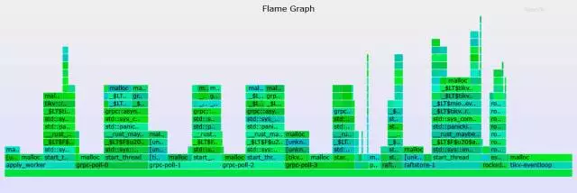
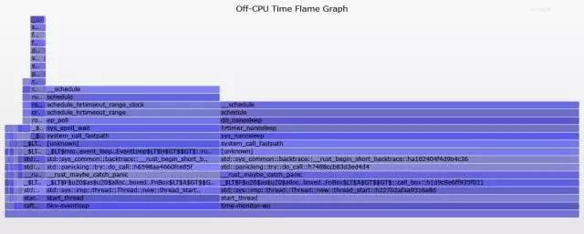

# Linux性能诊断perf使用指南

## 背景

Linux在服务端已占据非常大的比例，很多业务很多服务都跑在Linux上面。

软件运行在Linux下，软件本身、以及Linux系统的性能诊断也成为热门的话题。

例如，你要如何回答这些问题

```
Whyisthekernelon-CPUsomuch?Whatcode-paths?

Whichcode-pathsarecausingCPUlevel2cachemisses?

AretheCPUsstalledonmemoryI/O?

Whichcode-pathsareallocatingmemory,andhowmuch?

WhatistriggeringTCPretransmits?

Isacertainkernelfunctionbeingcalled,andhowoften?

WhatreasonsarethreadsleavingtheCPU?
```

又或者你是一名DBA或者开发人员，想知道数据库在跑某些benchmark时，性能瓶颈在哪里，是IO，是等待，还是网络，代码瓶颈在哪里？

在Linux下诊断的工具比较多，比如systemtap,dtrace,perf。

本文将介绍一下perf的用法，网上很多叫法如perf_events,perfprofiler,PerformanceCountersforLinux。叫法不同，都指perf。

## 什么是perf
perf是Linux2.6+内核中的一个工具，在内核源码包中的位置tools/perf。

perf利用Linux的trace特性，可以用于实时跟踪，统计event计数(perfstat)；或者使用采样(perfrecord)，报告(perfreport|script|annotate)的使用方式进行诊断。

perf命令行接口并不能利用所有的Linuxtrace特性，有些trace需要通过ftrace接口得到。

参考https://github.com/brendangregg/perf-tools

## perf工作原理


这张图大致列出了perf支持的跟踪事件，从kernerl到userspace，支持块设备、网络、CPU、文件系统、内存等，同时还支持系统调用，用户库的事件跟踪。

你可以使用perflist输出当前内核perf支持的预置events

```
perflist

Listofpre-definedevents(tobeusedin-e):

ref-cycles[Hardwareevent]

alignment-faults[Softwareevent]
context-switchesORcs[Softwareevent]
cpu-clock[Softwareevent]
cpu-migrationsORmigrations[Softwareevent]
dummy[Softwareevent]
emulation-faults[Softwareevent]
major-faults[Softwareevent]
minor-faults[Softwareevent]
page-faultsORfaults[Softwareevent]
task-clock[Softwareevent]

.....略.......

writeback:writeback_pages_written[Tracepointevent]
writeback:writeback_queue[Tracepointevent]
writeback:writeback_task_start[Tracepointevent]
writeback:writeback_task_stop[Tracepointevent]
```

### perfbackground

我们看到perf支持这么多的事件和trace，它依赖了很多的接口来干这件事情。

1. Symbols

没有符号表，无法将内存地址翻译成函数和变量名。

例如，无符号表的跟踪显示如下

```
57.14%sshdlibc-2.15.so[.]connect
|
---connect
|
|--25.00%--0x7ff3c1cddf29
|
|--25.00%--0x7ff3bfe82761
|0x7ff3bfe82b7c
|
|--25.00%--0x7ff3bfe82dfc
--25.00%--[...]
```

有符号表的跟踪显示如下

```
57.14%sshdlibc-2.15.so[.]__GI___connect_internal
|
---__GI___connect_internal
|
|--25.00%--add_one_listen_addr.isra.0
|
|--25.00%--__nscd_get_mapping
|__nscd_get_map_ref
|
|--25.00%--__nscd_open_socket
--25.00%--[...]
```

如何安装符号表?

对于内核代码的符号表，在编译内核时，使用CONFIG_KALLSYMS=y。检查如下

```
#cat/boot/config-`uname-r`|grepCONFIG_KALLSYMS
CONFIG_KALLSYMS=y
CONFIG_KALLSYMS_ALL=y
CONFIG_KALLSYMS_EXTRA_PASS=y
```

对于用户安装软件的符号表，如果是yum安装的，可以安装对应的debuginfo包。

如果是用户自己编译的，例如使用GCC编译时加上-g选项。

2. perfannotate

perfannotatecangeneratesourcecodelevelinformationiftheapplicationiscompiledwith-ggdb.

3. StackTraces(使用perfrecord-g收集stacktraces)

要跟踪完整的stack，编译时需要注意几个东西。

```
Alwayscompilewithframepointers.
Omittingframepointersisanevilcompileroptimizationthatbreaksdebuggers,andsadly,isoftenthedefault.

Withoutthem,youmayseeincompletestacksfromperf_events,likeseenintheearliersshdsymbolsexample.

Therearetwowaystofixthis:
eitherusingdwarfdatatounwindthestack,orreturningtheframepointers.
```

3.1 编译perf时包含libunwind和-gdwarf，需要3.9以上的内核版本。

```
Sinceaboutthe3.9kernel,perf_eventshassupportedaworkaroundformissingframepointersinuser-levelstacks:libunwind,whichusesdwarf.

Thiscanbeenabledusing"-gdwarf".

mangcc
-gdwarf-version
ProducedebugginginformationinDWARFformat(ifthatissupported).ThisistheformatusedbyDBXonIRIX6.Thevalueofversionmaybeeither2or3;thedefaultversionis3.

NotethatwithDWARFversion2someportsrequire,andwillalwaysuse,somenon-conflictingDWARF3extensionsintheunwindtables.
```

3.2 有些编译优化项会忽略framepointer，所以编译软件时必须指定-fno-omit-frame-pointer，才能跟踪完整的stacktrace.

```
TheearliersshdexamplewasadefaultbuildofOpenSSH,whichusescompileroptimizations(-O2),whichinthiscasehasomittedtheframepointer.

Here'showitlooksafterrecompilingOpenSSHwith-fno-omit-frame-pointer
```

3.3 编译内核时包含CONFIG_FRAME_POINTER=y

总结一下，要愉快的跟踪更完备的信息，就要在编译软件时打开符号表的支持(gcc-g)，开启annotate的支持(gcc-ggdb)，以及Stacktrace的支持(gcc-fno-omit-frame-pointer)。

### perfpre-definedevent说明

```
Hardware[Cache]Events:
CPU相关计数器
CPU周期、指令重试，内存间隔周期、L2CACHEmiss等
Theseinstrumentlow-levelprocessoractivitybasedonCPUperformancecounters.
Forexample,CPUcycles,instructionsretired,memorystallcycles,level2cachemisses,etc.
SomewillbelistedasHardwareCacheEvents.

SoftwareEvents:
内核相关计数器
Thesearelowleveleventsbasedonkernelcounters.
Forexample,CPUmigrations,minorfaults,majorfaults,etc.

TracepointEvents:
内核ftrace框架相关，例如系统调用，TCP事件，文件系统IO事件，块设备事件等。
根据LIBRARY归类。如sock表示socket事件。
Thisarekernel-leveleventsbasedontheftraceframework.Thesetracepointsareplacedininterestingandlogicallocationsofthekernel,sothathigher-levelbehaviorcanbeeasilytraced.
Forexample,systemcalls,TCPevents,filesystemI/O,diskI/O,etc.
Thesearegroupedintolibrariesoftracepoints;
eg,"sock:"forsocketevents,"sched:"forCPUschedulerevents.

DynamicTracing:
动态跟踪，可以在代码中的任何位置创建事件跟踪节点。很好很强大。
内核跟踪使用kprobe，user-level跟踪使用uprobe。
Softwarecanbedynamicallyinstrumented,creatingeventsinanylocation.
Forkernelsoftware,thisusesthekprobesframework.
Foruser-levelsoftware,uprobes.

TimedProfiling:
采样频度，按指定频率采样，被用于perfrecord。
Snapshotscanbecollectedatanarbitraryfrequency,usingperfrecord-FHz.
ThisiscommonlyusedforCPUusageprofiling,andworksbycreatingcustomtimedinterruptevents.
```

了解了perfevent后，我们可以更精细的，有针对性的对事件进行跟踪，采样，报告。

当然，你也可以不指定事件，全面采样。

## buildperf
例如centos你可以使用yum安装，也可以使用源码安装。

perf在内核源码的tools/perf中，所以下载与你的内核大版本一致的内核源码即可

```
uname-a

wgethttps://cdn.kernel.org/pub/linux/kernel/v3.x/linux-3.10.104.tar.xz

tar-xvflinux-3.10.104.tar.xz

cdlinux-3.10.104/tools/perf/
```

安装依赖库，有一个小窍门可以找到依赖的库

```
$catMakefile|grepfound

msg:=$(warningNolibelffound,disables'probe'tool,pleaseinstallelfutils-libelf-devel/libelf-dev);
msg:=$(errorNognu/libc-version.hfound,pleaseinstallglibc-dev[el]/glibc-static);
msg:=$(warningNolibdw.hfoundoroldlibdw.hfoundorelfutilsisolderthan0.138,disablesdwarfsupport.Pleaseinstallnewelfutils-devel/libdw-dev);
msg:=$(warningNolibunwindfound,disablingpostunwindsupport.Pleaseinstalllibunwind-dev[el]>=0.99);
msg:=$(warningNolibaudit.hfound,disables'trace'tool,pleaseinstallaudit-libs-develorlibaudit-dev);
msg:=$(warningslangnotfound,disablesTUIsupport.Pleaseinstallslang-develorlibslang-dev);
msg:=$(warningGTK2notfound,disablesGTK2support.Pleaseinstallgtk2-develorlibgtk2.0-dev);
$(if$(1),$(warningNo$(1)wasfound))
msg:=$(warningNobfd.h/libbfdfound,installbinutils-dev[el]/zlib-statictogainsymboldemangling)
msg:=$(warningNonuma.hfound,disables'perfbenchnumamem'benchmark,pleaseinstallnuma-libs-develorlibnuma-dev);
```

通常依赖gccmakebisonflexelfutilslibelf-devlibdw-devlibaudit-devpython-devbinutils-dev

### perf依赖的kernel宏

并不是每个开关都需要，但是有些没有就不方便或者功能缺失，例如没有打开符号表的话，看到的是一堆内存地址。

```
#forperf_events:
CONFIG_PERF_EVENTS=y
#forstacktraces:
CONFIG_FRAME_POINTER=y
#kernelsymbols:
CONFIG_KALLSYMS=y
#tracepoints:
CONFIG_TRACEPOINTS=y
#kernelfunctiontrace:
CONFIG_FTRACE=y
#kernel-leveldynamictracing:
CONFIG_KPROBES=y
CONFIG_KPROBE_EVENTS=y
#user-leveldynamictracing:
CONFIG_UPROBES=y
CONFIG_UPROBE_EVENTS=y
#fullkerneldebuginfo:
CONFIG_DEBUG_INFO=y
#kernellocktracing:
CONFIG_LOCKDEP=y
#kernellocktracing:
CONFIG_LOCK_STAT=y
#kerneldynamictracepointvariables:
CONFIG_DEBUG_INFO=y
```

一些开关的用途介绍

1. Kernel-levelsymbolsareinthekerneldebuginfopackage,orwhenthekerneliscompiledwithCONFIG_KALLSYMS.

2. Thekernelstacktracesareincomplete.NowasimilarprofilewithCONFIG_FRAME_POINTER=y

3. 当我们使用perfrecord[stacktraces(-g)]时，可以跟踪stack，但是如果内核编译时没有指定CONFIG_FRAME_POINTER=y，perfreport时就会看到缺失的信息。

不包含CONFIG_FRAME_POINTER=y时

```
99.97%swapper[kernel.kallsyms][k]default_idle
|
---default_idle

0.03%sshd[kernel.kallsyms][k]iowrite16
|
---iowrite16
__write_nocancel
(nil)
```

包含CONFIG_FRAME_POINTER=y时（Muchbetter--theentirepathfromthewrite()syscall(__write_nocancel)toiowrite16()canbeseen.）

```
99.97%swapper[kernel.kallsyms][k]default_idle
|
---default_idle
cpu_idle
|
|--87.50%--start_secondary
|
--12.50%--rest_init
start_kernel
x86_64_start_reservations
x86_64_start_kernel

0.03%sshd[kernel.kallsyms][k]iowrite16
|
---iowrite16
vp_notify
virtqueue_kick
start_xmit
dev_hard_start_xmit
sch_direct_xmit
dev_queue_xmit
ip_finish_output
ip_output
ip_local_out
ip_queue_xmit
tcp_transmit_skb
tcp_write_xmit
__tcp_push_pending_frames
tcp_sendmsg
inet_sendmsg
sock_aio_write
do_sync_write
vfs_write
sys_write
system_call_fastpath
__write_nocancel
```

4. 如果要使用动态跟踪，即跟踪任意指定代码，则需要打开这些开关:

Forkernelanalysis,usingCONFIG_KPROBES=yandCONFIG_KPROBE_EVENTS=y,toenablekerneldynamictracing.andCONFIG_FRAME_POINTER=y,forframepointer-basedkernelstacks.

Foruser-levelanalysis,CONFIG_UPROBES=yandCONFIG_UPROBE_EVENTS=y,foruser-leveldynamictracing.

5. 如果打开了CONFIG_DEBUG_INFO，则可以在动态跟踪中打印内核变量的值。

Ifyourkernelhasdebuginfo(CONFIG_DEBUG_INFO=y),youcanfishoutkernelvariablesfromfunctions.Thisisasimpleexampleofexaminingasize_t(integer)

例如

```
1.Listingvariablesavailablefortcp_sendmsg():

#perfprobe-Vtcp_sendmsg
Availablevariablesattcp_sendmsg
@<tcp_sendmsg+0>
size_tsize
structkiocb*iocb
structmsghdr*msg
structsock*sk

2.Creatingaprobefortcp_sendmsg()withthe"size"variable:

#perfprobe--add'tcp_sendmsgsize'
Addednewevent:
probe:tcp_sendmsg(ontcp_sendmsgwithsize)

3.Youcannowuseitinallperftools,suchas:

	perfrecord-eprobe:tcp_sendmsg-aRsleep1
```

通过以下命令可以查看linux的config

```
cat/boot/config-`uname-r`

#
#Automaticallygeneratedmakeconfig:don'tedit
#Linuxkernelversion:2.6.32-573.el6.x86_64
#ThuJul2315:38:202015
#
CONFIG_64BIT=y
#CONFIG_X86_32isnotset
CONFIG_X86_64=y
CONFIG_X86=y
CONFIG_OUTPUT_FORMAT="elf64-x86-64"
CONFIG_ARCH_DEFCONFIG="arch/x86/configs/x86_64_defconfig"
CONFIG_GENERIC_CMOS_UPDATE=y
.......
```

## perf使用说明

### perf--help

先了解一下概貌

perf命令用法还是挺简单的，根据功能区分了COMMAND，每个COMMAND有各自的用法。

用得比较多的有list,record,report,script,stat,top。

```
usage:perf[--version][--help][OPTIONS]COMMAND[ARGS]

Themostcommonlyusedperfcommandsare:
annotateReadperf.data(createdbyperfrecord)anddisplayannotatedcode
archiveCreatearchivewithobjectfileswithbuild-idsfoundinperf.datafile
benchGeneralframeworkforbenchmarksuites
buildid-cacheManagebuild-idcache.
buildid-listListthebuildidsinaperf.datafile
dataDatafilerelatedprocessing
diffReadperf.datafilesanddisplaythedifferentialprofile
evlistListtheeventnamesinaperf.datafile
injectFiltertoaugmenttheeventsstreamwithadditionalinformation
kmemTooltotrace/measurekernelmemoryproperties
kvmTooltotrace/measurekvmguestos
listListallsymboliceventtypes
lockAnalyzelockevents
memProfilememoryaccesses
recordRunacommandandrecorditsprofileintoperf.data
reportReadperf.data(createdbyperfrecord)anddisplaytheprofile
schedTooltotrace/measureschedulerproperties(latencies)
scriptReadperf.data(createdbyperfrecord)anddisplaytraceoutput
statRunacommandandgatherperformancecounterstatistics
testRunssanitytests.
timechartTooltovisualizetotalsystembehaviorduringaworkload
topSystemprofilingtool.
probeDefinenewdynamictracepoints
tracestraceinspiredtool

See'perfhelpCOMMAND'formoreinformationonaspecificcommand.
```

### perfhelpCOMMAND

要得到每个command的用法也蛮简单，可以使用perfhelpCOMMAND得到。

例如

```
perfhelprecord

PERF-RECORD(1)perfManualPERF-RECORD(1)

NAME
perf-record-Runacommandandrecorditsprofileintoperf.data

SYNOPSIS
perfrecord[-e<EVENT>|--event=EVENT][-l][-a]<command>
perfrecord[-e<EVENT>|--event=EVENT][-l][-a]—<command>[<options>]

DESCRIPTION
Thiscommandrunsacommandandgathersaperformancecounterprofilefromit,intoperf.data-withoutdisplayinganything.

Thisfilecanthenbeinspectedlateron,usingperfreport.

OPTIONS
<command>...
Anycommandyoucanspecifyinashell.
.....
```

### perftop跟踪实时信息

跟踪时可以指定事件，CPU，以及是否跟踪stacktrace。

```
perftop-ag

-a,--all-cpus
System-widecollection.(default)
-g
Enablescall-graph(stackchain/backtrace)recording.
```

输出如下

```
Samples:240ofevent'cpu-clock',Eventcount(approx.):19122881
ChildrenSelfSharedObjectSymbol
+14.64%14.64%[kernel][k]_spin_unlock_irqrestore
+10.91%10.91%libslang.so.2.2.1[.]SLtt_smart_puts
+6.02%6.02%perf[.]symbols__insert
+6.02%6.02%[kernel][k]kallsyms_expand_symbol
+6.01%6.01%[kernel][k]copy_page
+3.96%0.64%libc-2.12.so[.]_int_malloc
+3.61%3.61%[kernel][k]number
+3.31%3.31%[kernel][k]clear_page
+2.71%2.71%[kernel][k]pointer
....
```

输入?可以得到top的帮助介绍

```
│
│UP/DOWN/PGUP│
│PGDN/SPACENavigate│
│q/ESC/CTRL+CExitbrowser│
││
│Formultipleeventsessions:│
││
│TAB/UNTABSwitchevents│
││
│Forsymbolicviews(--sorthassym):│
││
│->ZoomintoDSO/Threads&Annotatecurrentsymbol│
│<-Zoomout│
│aAnnotatecurrentsymbol│
│CCollapseallcallchains│
│dZoomintocurrentDSO│
│EExpandallcallchains│
│FTogglepercentageoffilteredentries│
│HDisplaycolumnheaders│
│PPrinthistogramstoperf.hist.N│
│tZoomintocurrentThread│
│VVerbose(DSOnamesincallchains,etc)│
│zTogglezeroingofsamples│
│/Filtersymbolbyname
```

输入E全部展开，展开后可以得到stacktrace的结果,如果发现有地址的信息，但是没有符号表的信息，可能是软件编译时没有指定-g，如果stack信息不完整，则软件编译时需要加-fno-omit-frame-pointer(参考前面章节的介绍)。

```
Samples:1Kofevent'cpu-clock',Eventcount(approx.):17510648
ChildrenSelfSharedObjectSymbol
-28.51%28.51%[kernel][k]_spin_unlock_irqrestore
-→_spin_unlock_irqrestore[kernel]
17.24%__write_nocancellibc-2.12.so
13.79%0xe7cdlibpthread-2.12.so
10.34%0x7f670b15b923unknown
10.34%__fdatasync_nocancellibc-2.12.so
0x1b00000017unknown4
10.34%__libc_forklibc-2.12.so
6.90%__selectlibc-2.12.so
3.45%0x7f670b15b822unknown
3.45%0x7f670b14d560unknown
3.45%0x7f670b11ede7unknown
3.45%0x7f670b11eb5dunknown
0x2ad1pam_unix.so
0xdcdd4c000000000unknown
3.45%__clonelibc-2.12.so
3.45%__libc_writevlibc-2.12.so
3.45%__read_nocancellibc-2.12.so
3.45%0x7b294libslang.so.2.2.1
3.45%0x7efee6ee2560unknown
```

输入C全部收起

```
Samples:240ofevent'cpu-clock',Eventcount(approx.):19122881
ChildrenSelfSharedObjectSymbol
+14.64%14.64%[kernel][k]_spin_unlock_irqrestore
+10.91%10.91%libslang.so.2.2.1[.]SLtt_smart_puts
+6.02%6.02%perf[.]symbols__insert
+6.02%6.02%[kernel][k]kallsyms_expand_symbol
+6.01%6.01%[kernel][k]copy_page
+3.96%0.64%libc-2.12.so[.]_int_malloc
+3.61%3.61%[kernel][k]number
+3.31%3.31%[kernel][k]clear_page
+2.71%2.71%[kernel][k]pointer
....
```

Symbol列[]中字符代表的含义如下，通常是k或者.表示kernel和userspace事件。

```
[.]:userlevel
[k]:kernellevel
[g]:guestkernellevel(virtualization)
[u]:guestosuserspace
[H]:hypervisor
```

### perfrecord收集统计信息

perfrecord用来收集统计信息，通常的用法包括

1. 使用record收集统计信息，可以收集全局的，指定PID或者线程ID的，指定CPU的，指定USERID的。

```
-a,--all-cpus
System-widecollectionfromallCPUs.
-p,--pid=
RecordeventsonexistingprocessID(commaseparatedlist).
-t,--tid=
RecordeventsonexistingthreadID(commaseparatedlist).Thisoptionalsodisablesinheritancebydefault.Enableitbyadding--inherit.
-u,--uid=
Recordeventsinthreadsownedbyuid.Nameornumber.
```

2. 收集间隔，可以指定采样的频率，采样的EVENT数，采样时间。

```
-c,--count=
Eventperiodtosample.
-F,--freq=
Profileatthisfrequency.
```

3. 采集的详细程度，可以指定event，使用CPU实时调度策略的进程（可以参考RHEL讲CGROUPcpu部分的文章），是否跟踪stackchain，

```
-r,--realtime=
CollectdatawiththisRTSCHED_FIFOpriority.
-g
Enablescall-graph(stackchain/backtrace)recording.
--call-graph
Setupandenablecall-graph(stackchain/backtrace)recording,implies-g.

Allowsspecifying"fp"(framepointer)or"dwarf"
(DWARF′sCFI-CallFrameInformation)or"lbr"
(HardwareLastBranchRecordfacility)asthemethodtocollect
theinformationusedtoshowthecallgraphs.

Insomesystems,wherebinariesarebuildwithgcc
--fomit-frame-pointer,usingthe"fp"methodwillproducebogus
callgraphs,using"dwarf",ifavailable(perftoolslinkedto
thelibunwindlibrary)shouldbeusedinstead.
Usingthe"lbr"methoddoesn′trequireanycompileroptions.It
willproducecallgraphsfromthehardwareLBRregisters.The
mainlimitionisthatitisonlyavailableonnewIntel
platforms,suchasHaswell.Itcanonlygetusercallchain.It
doesn′tworkwithbranchstacksamplingatthesametime.
-e,--event=
SelectthePMUevent.Selectioncanbe:
·asymboliceventname(useperflisttolistallevents)
·arawPMUevent(eventsel+umask)intheformofrNNNwhereNNNisahexadecimaleventdescriptor.
·asymbolicallyformedPMUeventlikepmu/param1=0x3,param2/whereparam1,param2,etcaredefinedasformatsforthePMUin/sys/bus/event_sources/devices/<pmu>/format/*.
·asymbolicallyformedeventlikepmu/config=M,config1=N,config3=K/
whereM,N,Karenumbers(indecimal,hex,octalformat).Acceptable
valuesforeachof′config′,′config1′and′config2′aredefinedby
correspondingentriesin/sys/bus/event_sources/devices/<pmu>/format/*
param1andparam2aredefinedasformatsforthePMUin:
/sys/bus/event_sources/devices/<pmu>/format/*
·agroupofeventssurroundedbyapairofbrace("{event1,event2,...}").Eacheventisseparatedbycommasandthegroupshouldbequotedtopreventtheshellinterpretation.Youalsoneedtouse
--groupon"perfreport"toviewgroupeventstogether.
--filter=<filter>
Eventfilter.
```

例子

```
开始跑一个benchmark，同时收集统计信息(指定-a,-g选项)。
CFLAGS='-g-ggdb-fno-omit-frame-pointer'./configure--prefix=/home/digoal/pgsql9.6
makeworld-j32
makeinstall-world-j32
初始化略
pgbench-i-s100

跟踪
perfrecord-ag

Ctrl-C，退出perfrecord，统计信息已输出到perf.data。
```

### perfreport

解读前面收集到的perf.data.

常用的开关如下，--tui是交互式的文本显示窗口，--stdio是文本显示窗口。

```
-i,--input=
Inputfilename.(default:perf.data)
-v,--verbose
Bemoreverbose.(showsymboladdress,etc)
-n,--show-nr-samples
Showthenumberofsamplesforeachsymbol
-g[type,min],--call-graph
Displaycallchainsusingtypeandminpercentthreshold.typecanbeeither:
·flat:singlecolumn,linearexposureofcallchains.
·graph:useagraphtree,displayingabsoluteoverheadrates.
·fractal:likegraph,butdisplaysrelativerates.Eachbranchofthetreeisconsideredasanewprofiledobject.
Default:fractal,0.5.
--stdio
Usethestdiointerface.
--tui
UsetheTUIinterface,thatisintegratedwithannotateandallowszoomingintoDSOsorthreads,amongotherfeatures.Useof--tuirequiresatty,ifoneisnotpresent,aswhenpipingtoother
commands,thestdiointerfaceisused.
```

交互式显示例子，看概貌挺方便的(常用的交互命令:E扩展，C收敛，q退出)

```
#perfreport-g--tui

Events:52Kcycles
+11.17%postgrespostgres[.]hash_seq_search[.]表示usercall,[k]表示kernelcall
+4.41%pgbenchlibc-2.12.so[.]__GI_vfprintf
+4.02%postgrespostgres[.]NextCopyFrom
+3.27%postgres[kernel.kallsyms][k]copy_user_generic_string
+2.83%postgrespostgres[.]CopyReadLineText
+2.25%postgrespostgres[.]pg_comp_crc32c_sse42
+2.18%postgreslibc-2.12.so[.]memcpy
+1.99%postgrespostgres[.]CopyReadAttributesText
+1.72%postgres[xfs][k]ftrace_raw_init_event_xfs_dir2_leafn_add
+1.65%postgrespostgres[.]heap_fill_tuple
+1.52%postgreslibc-2.12.so[.]__GI_____strtoll_l_internal
+1.26%postgrespostgres[.]heap_form_tuple
+1.22%pgbenchlibc-2.12.so[.]_IO_default_xsputn_internal
+1.17%postgrespostgres[.]AllocSetAlloc
+1.16%postgrespostgres[.]heap_compute_data_size
+1.10%postgrespostgres[.]heap_multi_insert
+1.03%postgrespostgres[.]pg_atoi
+1.03%postgreslibc-2.12.so[.]__memset_sse2
+1.01%postgrespostgres[.]pg_verify_mbstr_len
+0.95%pgbenchlibc-2.12.so[.]_itoa_word
+0.89%postgrespostgres[.]int4in
+0.83%postgrespostgres[.]resetStringInfo
+0.81%postgrespostgres[.]InputFunctionCall
+0.81%postgrespostgres[.]hash_search_with_hash_value
+0.79%postgrespostgres[.]ExecConstraints
+0.71%postgrespostgres[.]CopyFrom
+0.71%pgbenchlibc-2.12.so[.]__strchrnul
+0.67%postgrespostgres[.]PageAddItemExtended
+0.66%postgres[kernel.kallsyms][k]find_get_page
+0.65%postgrespostgres[.]CopyReadLine
+0.62%postgres[kernel.kallsyms][k]page_fault
+0.58%postgrespostgres[.]heap_prepare_insert
+0.57%postgrespostgres[.]heap_prune_chain
+0.52%postgrespostgres[.]bpcharin
+0.52%pgbenchlibpq.so.5.9[.]PQputCopyData
+0.52%postgrespostgres[.]AllocSetFreeIndex
+0.52%postgrespostgres[.]pq_getbytes
+0.51%postgrespostgres[.]RelationPutHeapTuple
+0.49%postgrespostgres[.]BufferGetBlockNumber
+0.47%postgrespostgres[.]enlargeStringInfo
+0.47%postgrespostgres[.]bpchar_input
+0.46%postgrespostgres[.]CopyGetData
+0.45%postgrespostgres[.]lazy_scan_heap
+0.45%postgres[kernel.kallsyms][k]radix_tree_lookup_slot
+0.44%pgbenchlibpq.so.5.9[.]PQputline
+0.44%postgrespostgres[.]CopyLoadRawBuf
+0.42%postgrespostgres[.]HeapTupleSatisfiesVacuum
+0.42%postgres[kernel.kallsyms][k]_spin_lock_irq
+0.42%postgres[kernel.kallsyms][k]list_del
+0.38%flush-8:16[xfs][k]ftrace_raw_init_event_xfs_dir2_leafn_add
+0.37%postgrespostgres[.]ExecStoreTuple
+0.36%postgrespostgres[.]appendBinaryStringInfo
+0.35%postgrespostgres[.]pq_getmessage
+0.35%pgbenchlibpq.so.5.9[.]pqPutMsgEnd
Press'?'forhelponkeybindings
```

文本显示例子，看细节挺方便

```
#perfreport-v-n--showcpuutilization-g--stdio
```

首先显示了一些异常，如果你发现少了符号表或者什么的，可以根据提示安装debuginfo，或者重新编译内核或软件。

```
Lookingatthevmlinux_path(6entrieslong)
dso__load_sym:cannotgetelfheader.
Using/proc/kallsymsforsymbols
Lookingatthevmlinux_path(6entrieslong)
Nokallsymsorvmlinuxwithbuild-id3187a0b0fc53e27c19f9fad3e63f9437402e5548wasfound
[bianque_driver]withbuildid3187a0b0fc53e27c19f9fad3e63f9437402e5548notfound,continuingwithoutsymbols
Lookingatthevmlinux_path(6entrieslong)
Nokallsymsorvmlinuxwithbuild-ide6c06734499e665685cd28ac846d8d69d95cce8cwasfound
[missing_slash]withbuildide6c06734499e665685cd28ac846d8d69d95cce8cnotfound,continuingwithoutsymbols
/lib64/ld-2.12.sowasupdated,restartthelongrunningappsthatuseit!
/usr/lib64/libsyslog-ng-3.6.so.0.0.0wasupdated,restartthelongrunningappsthatuseit!
/disk1/gpdb_20160101/bin/postgreswasupdated,restartthelongrunningappsthatuseit!
Lookingatthevmlinux_path(6entrieslong)
Nokallsymsorvmlinuxwithbuild-id253ed41ca3926c96e4181ac4df30cf3cde868089wasfound
[pdeath_signal]withbuildid253ed41ca3926c96e4181ac4df30cf3cde868089notfound,continuingwithoutsymbols
nosymbolsfoundin/sbin/iscsid,maybeinstalladebugpackage?
nosymbolsfoundin/bin/egrep,maybeinstalladebugpackage?
nosymbolsfoundin/usr/sbin/dmidecode,maybeinstalladebugpackage?
/opt/aegis/lib64/aegis_monitor.sowasupdated,restartthelongrunningappsthatuseit!
```

报告的细节如下

```
#Events:52Kcycles
#
#OverheadSamplessysusCommandSharedObject
#事件百分比采样百分比系统消耗占比系统消耗u秒命令共享对象
#............................................................................................................................................
#

第一条
事件百分比采样百分比系统消耗占比系统消耗u秒命令共享对象
11.17%0.00%5.56%2173postgres/home/digoal/pgsql9.6/bin/postgres0x50eb35B[.]hash_seq_search
|
---hash_seq_search(输出callstacktrace，需要在编译软件时开启-g开关,-fno-omit-frame-pointer开关)
GetRunningTransactionLocks
LogStandbySnapshot(有两个分支会调用LogStandbySnapshot)
|
|--50.23%--CreateCheckPoint(分支开销占比)
|CheckpointerMain
|AuxiliaryProcessMain
|StartChildProcess
|reaper
|__restore_rt
|PostmasterMain
|startup_hacks
|__libc_start_main
|
--49.77%--BackgroundWriterMain(分支开销占比)
AuxiliaryProcessMain
StartChildProcess
reaper
__restore_rt
PostmasterMain
startup_hacks
__libc_start_main

下面这条全部是系统开销
4.41%0.00%4.41%1808pgbench/lib64/libc-2.12.so0x44005B[.]__GI_vfprintf
|
---__GI_vfprintf
|
|--99.48%--__vsnprintf
||
后面。。。。。。略
```

### perfscript

一条条打印perf.data内的数据，输出的是perfrecord收集到的原始数据。

生成热力图、火焰图也需要perfscript的输出，从最原始的信息中提取数据，生成svg。

```
perf-script-Readperf.data(createdbyperfrecord)anddisplaytraceoutput

主要的options
-G,--hide-call-graph
Whenprintingsymbolsdonotdisplaycallchain.
-v,--verbosebemoreverbose(showsymboladdress,etc)
-L,--Latencyshowlatencyattributes(irqs/preemptiondisabled,etc)
-d,--debug-modedovariouscheckslikesamplesorderingandlostevents
-D,--dump-raw-tracedumprawtraceinASCII

#perfscript-v-G|wc-l
52958

刚好等于前面使用perfreport输出的#Events:52Kcycles

详细内容就不列出了，非常多
```

### perfannotate

解读前面收集到的perf.data，辅以汇编指令显示。

```
perf-annotate-Readperf.data(createdbyperfrecord)anddisplayannotatedcode

-i,--input=
Inputfilename.(default:perf.data)
-v,--verbose
Bemoreverbose.(Showsymboladdress,etc)
-D,--dump-raw-trace
DumprawtraceinASCII.
-l,--print-line
Printmatchingsourcelines(maybeslow).
-P,--full-paths
Don’tshortenthedisplayedpathnames.
--stdio
Usethestdiointerface.
--tui
UsetheTUIinterfaceUseof--tuirequiresatty,ifoneisnotpresent,aswhenpipingtoothercommands,thestdiointerfaceisused.Thisinterfacesstartsbycenteringonthelinewithmore
samples,TAB/UNTABcyclesthroughthelineswithmoresamples.
```

例子

```
Sortedsummaryforfile/home/digoal/pgsql9.6/bin/postgres
----------------------------------------------

32.43/home/digoal/postgresql-9.6.1/src/backend/utils/hash/dynahash.c:1403(discriminator1)
16.20/home/digoal/postgresql-9.6.1/src/backend/utils/hash/dynahash.c:1403(discriminator1)
14.16/home/digoal/postgresql-9.6.1/src/backend/utils/hash/dynahash.c:1403(discriminator1)
10.68/home/digoal/postgresql-9.6.1/src/backend/utils/hash/dynahash.c:1406
10.68/home/digoal/postgresql-9.6.1/src/backend/utils/hash/dynahash.c:1403(discriminator1)
9.97/home/digoal/postgresql-9.6.1/src/backend/utils/hash/dynahash.c:1412
3.76/home/digoal/postgresql-9.6.1/src/backend/utils/hash/dynahash.c:1403(discriminator1)
Percent|Sourcecode&Disassemblyof/home/digoal/pgsql9.6/bin/postgres
------------------------------------------------
50eac0:466
50eac4:1
50eac7:3
50eaca:1
50eaec:435
50eaf5:12
50eafb:7
50eb00:20
50eb08:5
50eb10:8
50eb14:1
50eb18:5
50eb1b:4
50eb1e:15
50eb22:466
50eb26:2
50eb2e:2
50eb32:6
50eb35:618
50eb38:707
50eb3c:164
50eb41:1415
h->sum:4363
:
:
:
:Disassemblyofsection.text:
:
:000000000090e9cc<hash_seq_search>:
:register_seq_scan(hashp);
:}
:
:void*
:hash_seq_search(HASH_SEQ_STATUS*status)
:{
0.00:90e9cc:55push%rbp
0.00:90e9cd:4889e5mov%rsp,%rbp
0.00:90e9d0:4883ec60sub$0x60,%rsp
0.00:90e9d4:48897da8mov%rdi,-0x58(%rbp)
:longsegment_ndx;
:HASHSEGMENTsegp;
:uint32curBucket;
:HASHELEMENT*curElem;
:
:if((curElem=status->curEntry)!=NULL)
0.00:90e9d8:488b45a8mov-0x58(%rbp),%rax
0.00:90e9dc:488b4010mov0x10(%rax),%rax
0.00:90e9e0:488945d8mov%rax,-0x28(%rbp)
0.00:90e9e4:48837dd800cmpq$0x0,-0x28(%rbp)
0.00:90e9e9:743aje90ea25<hash_seq_search+0x59>
:{
:/*ContinuingscanofcurBucket...*/
:status->curEntry=curElem->link;
0.00:90e9eb:488b45d8mov-0x28(%rbp),%rax
0.00:90e9ef:488b10mov(%rax),%rdx
0.00:90e9f2:488b45a8mov-0x58(%rbp),%rax
0.00:90e9f6:48895010mov%rdx,0x10(%rax)
:if(status->curEntry==NULL)/*endofthisbucket*/
0.00:90e9fa:488b45a8mov-0x58(%rbp),%rax
0.00:90e9fe:488b4010mov0x10(%rax),%rax
0.00:90ea02:4885c0test%rax,%rax
0.00:90ea05:7511jne90ea18<hash_seq_search+0x4c>
:++status->curBucket;
0.00:90ea07:488b45a8mov-0x58(%rbp),%rax
0.00:90ea0b:8b4008mov0x8(%rax),%eax
0.00:90ea0e:8d5001lea0x1(%rax),%edx
0.00:90ea11:488b45a8mov-0x58(%rbp),%rax
0.00:90ea15:895008mov%edx,0x8(%rax)
:return(void*)ELEMENTKEY(curElem);
0.00:90ea18:488b45d8mov-0x28(%rbp),%rax
0.00:90ea1c:4883c010add$0x10,%rax
0.00:90ea20:e954010000jmpq90eb79<hash_seq_search+0x1ad>
:}
:
:/*
:*SearchfornextnonemptybucketstartingatcurBucket.
:*/
:curBucket=status->curBucket;
0.00:90ea25:488b45a8mov-0x58(%rbp),%rax
0.00:90ea29:8b4008mov0x8(%rax),%eax
0.00:90ea2c:8945e4mov%eax,-0x1c(%rbp)
:hashp=status->hashp;
0.00:90ea2f:488b45a8mov-0x58(%rbp),%rax
0.00:90ea33:488b00mov(%rax),%rax
0.00:90ea36:488945d0mov%rax,-0x30(%rbp)
:hctl=hashp->hctl;
0.00:90ea3a:488b45d0mov-0x30(%rbp),%rax
0.00:90ea3e:488b00mov(%rax),%rax
0.00:90ea41:488945c8mov%rax,-0x38(%rbp)
:ssize=hashp->ssize;
0.00:90ea45:488b45d0mov-0x30(%rbp),%rax
0.00:90ea49:488b4050mov0x50(%rax),%rax
0.00:90ea4d:488945c0mov%rax,-0x40(%rbp)
:max_bucket=hctl->max_bucket;
0.00:90ea51:488b45c8mov-0x38(%rbp),%rax
0.00:90ea55:8b8010030000mov0x310(%rax),%eax
0.00:90ea5b:8945bcmov%eax,-0x44(%rbp)
:
:if(curBucket>max_bucket)
0.00:90ea5e:8b45e4mov-0x1c(%rbp),%eax
0.00:90ea61:3b45bccmp-0x44(%rbp),%eax
0.00:90ea64:7616jbe90ea7c<hash_seq_search+0xb0>
:{
:hash_seq_term(status);
0.00:90ea66:488b45a8mov-0x58(%rbp),%rax
0.00:90ea6a:4889c7mov%rax,%rdi
0.00:90ea6d:e809010000callq90eb7b<hash_seq_term>
:returnNULL;/*searchisdone*/
0.00:90ea72:b800000000mov$0x0,%eax
0.00:90ea77:e9fd000000jmpq90eb79<hash_seq_search+0x1ad>
:}
:
:/*
:*firstfindtherightsegmentinthetabledirectory.
:*/
:segment_num=curBucket>>hashp->sshift;
0.00:90ea7c:488b45d0mov-0x30(%rbp),%rax
0.00:90ea80:8b4058mov0x58(%rax),%eax
0.00:90ea83:8b55e4mov-0x1c(%rbp),%edx
0.00:90ea86:89c1mov%eax,%ecx
0.00:90ea88:d3eashr%cl,%edx
0.00:90ea8a:89d0mov%edx,%eax
0.00:90ea8c:89c0mov%eax,%eax
0.00:90ea8e:488945f8mov%rax,-0x8(%rbp)
:segment_ndx=MOD(curBucket,ssize);
0.00:90ea92:8b45e4mov-0x1c(%rbp),%eax
0.00:90ea95:488b55c0mov-0x40(%rbp),%rdx
0.00:90ea99:4883ea01sub$0x1,%rdx
0.00:90ea9d:4821d0and%rdx,%rax
0.00:90eaa0:488945f0mov%rax,-0x10(%rbp)
:
:segp=hashp->dir[segment_num];
0.00:90eaa4:488b45d0mov-0x30(%rbp),%rax
0.00:90eaa8:488b4008mov0x8(%rax),%rax
0.00:90eaac:488b55f8mov-0x8(%rbp),%rdx
0.00:90eab0:48c1e203shl$0x3,%rdx
0.00:90eab4:4801d0add%rdx,%rax
0.00:90eab7:488b00mov(%rax),%rax
0.00:90eaba:488945e8mov%rax,-0x18(%rbp)
:*Pickupthefirstiteminthisbucket'schain.Ifchainisnotempty
:*wecanbeginsearchingit.Otherwisewehavetoadvancetofindthe
:*nextnonemptybucket.Wetrytooptimizethatcasesincesearchinga
:*near-emptyhashtablehastoiteratethisloopalot.
:*/
:while((curElem=segp[segment_ndx])==NULL)
0.00:90eabe:eb62jmp90eb22<hash_seq_search+0x156>
:{
:/*emptybucket,advancetonext*/
:if(++curBucket>max_bucket)
/home/digoal/postgresql-9.6.1/src/backend/utils/hash/dynahash.c:1406
10.68:90eac0:8345e401addl$0x1,-0x1c(%rbp)
0.02:90eac4:8b45e4mov-0x1c(%rbp),%eax
0.07:90eac7:3b45bccmp-0x44(%rbp),%eax
0.02:90eaca:7620jbe90eaec<hash_seq_search+0x120>
:{
:status->curBucket=curBucket;
0.00:90eacc:488b45a8mov-0x58(%rbp),%rax
0.00:90ead0:8b55e4mov-0x1c(%rbp),%edx
0.00:90ead3:895008mov%edx,0x8(%rax)
:hash_seq_term(status);
0.00:90ead6:488b45a8mov-0x58(%rbp),%rax
0.00:90eada:4889c7mov%rax,%rdi
0.00:90eadd:e899000000callq90eb7b<hash_seq_term>
:returnNULL;/*searchisdone*/
0.00:90eae2:b800000000mov$0x0,%eax
0.00:90eae7:e98d000000jmpq90eb79<hash_seq_search+0x1ad>
:}
:if(++segment_ndx>=ssize)
/home/digoal/postgresql-9.6.1/src/backend/utils/hash/dynahash.c:1412
9.97:90eaec:488345f001addq$0x1,-0x10(%rbp)
0.00:90eaf1:488b45f0mov-0x10(%rbp),%rax
0.28:90eaf5:483b45c0cmp-0x40(%rbp),%rax
0.00:90eaf9:7c27jl90eb22<hash_seq_search+0x156>
:{
:segment_num++;
0.16:90eafb:488345f801addq$0x1,-0x8(%rbp)
:segment_ndx=0;
0.46:90eb00:48c745f0000000movq$0x0,-0x10(%rbp)
0.00:90eb07:00
:segp=hashp->dir[segment_num];
0.11:90eb08:488b45d0mov-0x30(%rbp),%rax
0.00:90eb0c:488b4008mov0x8(%rax),%rax
0.18:90eb10:Can'tannotatecopy_user_generic_string:Novmlinuxfilewithbuildid7f980c04dad5ff7955a0035ceddb54b83d0b1ab1wasfoundinthepath.
Pleaseuse'perfbuildid-cache-avvmlinux'or--vmlinuxvmlinux.
symbol__annotate:filename=/root/.debug/.build-id/3a/c348a69f62bfc2280da1a8188173961bb2e9be,sym=__GI_vfprintf,start=0x7fed22c73d10,end=0x7fed22c78e78
annotating[0xba0c30]/lib64/libc-2.12.so:[0x1c7c310]__GI_vfprintf
Executing:objdump--start-address=0x0000000000043d10--stop-address=0x0000000000048e78-dS-C/root/.debug/.build-id/3a/c348a69f62bfc2280da1a8188173961bb2e9be|grep-v/root/.debug/.build-id/3a/c348a69f62bfc2280da1a8188173961bb2e9be|expa
488b55f8mov-0x8(%rbp),%rdx
0.02:90eb14:48c1e203shl$0x3,%rdx
0.11:90eb18:4801d0add%rdx,%rax
0.09:90eb1b:488b00mov(%rax),%rax
0.34:90eb1e:488945e8mov%rax,-0x18(%rbp)
:*Pickupthefirstiteminthisbucket'schain.Ifchainisnotempty
:*wecanbeginsearchingit.Otherwisewehavetoadvancetofindthe
:*nextnonemptybucket.Wetrytooptimizethatcasesincesearchinga
:*near-emptyhashtablehastoiteratethisloopalot.
:*/
:while((curElem=segp[segment_ndx])==NULL)
/home/digoal/postgresql-9.6.1/src/backend/utils/hash/dynahash.c:1403(discriminator1)
10.68:90eb22:488b45f0mov-0x10(%rbp),%rax
0.05:90eb26:488d14c5000000lea0x0(,%rax,8),%rdx
0.00:90eb2d:00
0.05:90eb2e:488b45e8mov-0x18(%rbp),%rax
0.14:90eb32:4801d0add%rdx,%rax
14.16:90eb35:488b00mov(%rax),%rax
16.20:90eb38:488945d8mov%rax,-0x28(%rbp)
/home/digoal/postgresql-9.6.1/src/backend/utils/hash/dynahash.c:1403(discriminator1)
3.76:90eb3c:48837dd800cmpq$0x0,-0x28(%rbp)
/home/digoal/postgresql-9.6.1/src/backend/utils/hash/dynahash.c:1403(discriminator1)
32.43:90eb41:0f8479ffffffje90eac0<hash_seq_search+0xf4>
:segp=hashp->dir[segment_num];
:}
:}
:
:/*BeginscanofcurBucket...*/
:status->curEntry=curElem->link;
0.00:90eb47:488b45d8mov-0x28(%rbp),%rax
0.00:90eb4b:488b10mov(%rax),%rdx
0.00:90eb4e:488b45a8mov-0x58(%rbp),%rax
0.00:90eb52:48895010mov%rdx,0x10(%rax)
:if(status->curEntry==NULL)/*endofthisbucket*/
0.00:90eb56:488b45a8mov-0x58(%rbp),%rax
0.00:90eb5a:488b4010mov0x10(%rax),%rax
0.00:90eb5e:4885c0test%rax,%rax
0.00:90eb61:7504jne90eb67<hash_seq_search+0x19b>
:++curBucket;
0.00:90eb63:8345e401addl$0x1,-0x1c(%rbp)
:status->curBucket=curBucket;
0.00:90eb67:488b45a8mov-0x58(%rbp),%rax
0.00:90eb6b:8b55e4mov-0x1c(%rbp),%edx
0.00:90eb6e:895008mov%edx,0x8(%rax)
:return(void*)ELEMENTKEY(curElem);
0.00:90eb71:488b45d8mov-0x28(%rbp),%rax
0.00:90eb75:4883c010add$0x10,%rax
:}
0.00:90eb79:c9leaveq

Sortedsummaryforfile/lib64/libc-2.12.so
----------------------------------------------

4.34??:0
3.71??:0
3.24??:0
2.93??:0
2.93??:0
略
```

### perfbench

用来测试系统的一些常见指标的性能(如IPC,messageorpipe,memcpy)。

```
perf-bench-Generalframeworkforbenchmarksuites

SYNOPSIS
perfbench[<commonoptions>]<subsystem><suite>[<options>]
SUBSYSTEM
sched
SchedulerandIPCmechanisms.

SUITESFORsched
messaging
SuiteforevaluatingperformanceofschedulerandIPCmechanisms.BasedonhackbenchbyRustyRussell.

Optionsofmessaging
-p,--pipe
Usepipe()insteadofsocketpair()

-t,--thread
Bemultithreadinsteadofmultiprocess

-g,--group=
Specifynumberofgroups

-l,--loop=
Specifynumberofloops

Exampleofmessaging
.ftC
%perfbenchschedmessaging#runwithdefault
options(20senderandreceiverprocessespergroup)
(10groups==400processesrun)

Totaltime:0.308sec

%perfbenchschedmessaging-t-g20#bemulti-thread,with20groups
(20senderandreceiverthreadspergroup)
(20groups==800threadsrun)

Totaltime:0.582sec
.ft

pipe
Suiteforpipe()systemcall.Basedonpipe-test-1m.cbyIngoMolnar.

Optionsofpipe
-l,--loop=
Specifynumberofloops.

Exampleofpipe
.ftC
%perfbenchschedpipe
(executing1000000pipeoperationsbetweentwotasks)

Totaltime:8.091sec
8.091833usecs/op
123581ops/sec

%perfbenchschedpipe-l1000#loop1000
(executing1000pipeoperationsbetweentwotasks)

Totaltime:0.016sec
16.948000usecs/op
59004ops/sec
.ft
```

例子

测试进程或线程通信性能

```
使用200个进程
#perfbenchschedmessaging-g200-l100
#Runningsched/messagingbenchmark...
#20senderandreceiverprocessespergroup
#200groups==8000processesrun

Totaltime:2.665[sec]
```

```
使用200个线程代替进程
#perfbenchschedmessaging-g200-l100-t
#Runningsched/messagingbenchmark...
#20senderandreceiverthreadspergroup
#200groups==8000threadsrun

Totaltime:2.025[sec]
```

```
使用线程,使用pipe()代替socketpair()
#perfbenchschedmessaging-g200-l100-t-p
#Runningsched/messagingbenchmark...
#20senderandreceiverthreadspergroup
#200groups==8000threadsrun

Totaltime:1.028[sec]
```

```
使用进程,使用pipe()代替socketpair()
#perfbenchschedmessaging-g200-l100-p
#Runningsched/messagingbenchmark...
#20senderandreceiverprocessespergroup
#200groups==8000processesrun

Totaltime:1.126[sec]
```

从测试来看，线程,pipe()通信效率是最高的。

测试pipe()

```
#perfbenchschedpipe-l100000
#Runningsched/pipebenchmark...
#Executed100000pipeoperationsbetweentwotasks

Totaltime:0.785[sec]

7.851860usecs/op
127358ops/sec
```

测试所有，包括memcpy

```
#perfbenchall
#Runningsched/messagingbenchmark...
#20senderandreceiverprocessespergroup
#10groups==400processesrun

Totaltime:0.102[sec]

#Runningsched/pipebenchmark...
#Executed1000000pipeoperationsbetweentwotasks

Totaltime:7.967[sec]

7.967202usecs/op
125514ops/sec

#Runningmem/memcpybenchmark...
#Copying1MBBytesfrom0x7f360c80c010to0x7f360f5d9010...

855.431993MB/Sec
```

### perfstat

perf除了可以采样(使用perfrecord)（包括callstacktrace），还可以用于event计数。

perfstat就是用于event计数的，可以跟踪指定命令的event计数。

```
NAME
perf-stat-Runacommandandgatherperformancecounterstatistics

SYNOPSIS
perfstat[-e<EVENT>|--event=EVENT][-a]<command>
perfstat[-e<EVENT>|--event=EVENT][-a]—<command>[<options>]

DESCRIPTION
Thiscommandrunsacommandandgathersperformancecounterstatisticsfromit.

跟踪指定command，或者pid,tid，或指定cgroup的event计数
<command>...
Anycommandyoucanspecifyinashell.
-r,--repeat=<n>重复执行N次命令
repeatcommandandprintaverage+stddev(max:100)
-p,--pid=<pid>
stateventsonexistingprocessid
-t,--tid=<tid>
stateventsonexistingthreadid
-Gname,--cgroupname
monitoronlyinthecontainer(cgroup)called"name".Thisoptionisavailableonlyinper-cpumode.Thecgroupfilesystemmustbemounted.Allthreadsbelongingtocontainer"name"aremonitoredwhen
theyrunonthemonitoredCPUs.Multiplecgroupscanbeprovided.Eachcgroupisappliedtothecorrespondingevent,i.e.,firstcgrouptofirstevent,secondcgrouptosecondeventandsoon.Itis
possibletoprovideanemptycgroup(monitorallthetime)using,e.g.,-Gfoo,,bar.Cgroupsmusthavecorrespondingevents,i.e.,theyalwaysrefertoeventsdefinedearlieronthecommandline.

只跟踪指定事件
-e,--event=
SelectthePMUevent.
	Selectioncanbeasymboliceventname(useperflisttolistallevents)orarawPMUevent(eventsel+umask)intheformofrNNNwhereNNNisahexadecimaleventdescriptor.

跟踪所有CPU
-a,--all-cpus
system-widecollectionfromallCPUs

输出相关
-c,--scale
scale/normalizecountervalues
-B,--big-num
printlargenumberswiththousands′separatorsaccordingtolocale
-v,--verbose
bemoreverbose(showcounteropenerrors,etc)
```

例子

```
124331digoal20093.0g38g38gS0.020.60:28.21/home/digoal/pgsql9.6/bin/postgres
124589digoal200125m972464S0.00.00:00.03postgres:loggerprocess
124592digoal20093.0g2.1g2.1gS0.01.10:11.64postgres:checkpointerprocess
124593digoal20093.0g2.1g2.1gS0.01.10:13.18postgres:writerprocess
124594digoal20093.0g129m128mS0.00.10:03.82postgres:walwriterprocess
124595digoal20093.0g21721360S0.00.00:00.43postgres:autovacuumlauncherprocess
124596digoal200127m1076548S0.00.00:00.33postgres:archiverprocessfailedon00000001000000820000002D
124597digoal200127m1132560S0.00.00:00.93postgres:statscollectorprocess

pgbench-Mprepared-n-r-P1-c32-j32-T1000
```

```
跟踪10秒walwriter进程

#perfstat-p124594-a-c-B-vsleep10

task-clock:240196875907240196865902240196818048
context-switches:966775240197106316240197074990
CPU-migrations:24926240197787932240197772224
page-faults:350142240196568475240196568475
cycles:376379394416239735813498198569141526
stalled-cycles-frontend:305098988594239733245755199380423076
stalled-cycles-backend:205940630988239730830300160173568784
instructions:233667165879239725298183200717526856
branches:38305737741239719766523201249886312
branch-misses:524692310239712708191199567372892

Performancecounterstatsforprocessid'124594':

240196.875907task-clock#23.997CPUsutilized[100.00%]
966,775context-switches#0.004M/sec[100.00%]
24,926CPU-migrations#0.000M/sec[100.00%]
350,142page-faults#0.001M/sec
376,379,394,416cycles#1.567GHz[82.83%]
305,098,988,594stalled-cycles-frontend#81.06%frontendcyclesidle[83.17%]
205,940,630,988stalled-cycles-backend#54.72%backendcyclesidle[66.81%]
233,667,165,879instructions#0.62insnspercycle注意一个cycle只执行了0.62条指令，说明有大量的等待，并没有充分发挥CPU的性能，也说明了系统存在瓶颈。
#1.31stalledcyclesperinsn[83.73%]每个指令的空闲CPU周期，越大说明CPU越闲，没干活。
38,305,737,741branches#159.476M/sec[83.95%]
524,692,310branch-misses#1.37%ofallbranches[83.25%]

10.009649400secondstimeelapsed

如果insnspercycle很大，但是实际软件的运行效率确很低时，可能是类似SPINLOCK，导致CPU空转，实际没有干活。
```

如果你想跟踪PostgreSQL数据库，可以把数据库的所有进程塞到CGROUP里，然后使用perfstat-Gcgname统计整个CGROUP。

perfstat还支持-e指定事件，事件支持通配符。

```
$sudoperfstat-eblock:block_rq_*,syscalls:sys_enter_write,syscalls:sys_enter_fsync-a-r5--psql-q-Upostgrescraig-c"droptableifexistsx;createtablexasselectaFROMgenerate_series(1,1000000)a;";

Performancecounterstatsfor'psql-Upostgrescraig-cdroptableifexistsx;createtablexasselectaFROMgenerate_series(1,1000000)a;'(5runs):

0block:block_rq_abort[100.00%]
0block:block_rq_requeue[100.00%]
97block:block_rq_complete(+-14.82%)[100.00%]
96block:block_rq_insert(+-14.97%)[100.00%]
98block:block_rq_issue(+-14.67%)[100.00%]
0block:block_rq_remap[100.00%]
10,607syscalls:sys_enter_write(+-0.17%)[100.00%]
1syscalls:sys_enter_fsync

0.908835058secondstimeelapsed(+-18.31%)

或者
perfstat-eblock:*,syscalls:*-a-r5--psql-q-Upostgrescraig-c"droptableifexistsx;createtablexasselectaFROMgenerate_series(1,1000000)a;";
```

### perfeventmodifier

使用instruction:modifier可以指定要跟踪的instruction在哪里？在kernelspace或userspace，又或者在虚拟机，虚拟机OS，宿主机OS等。

modifier用法如下，写在event:后面。

Modifiers|	Description|	Example
---|---|---
u|	monitoratprivlevel3,2,1(user)	|event:u
k|	monitoratprivlevel0(kernel)	|event:k
h|	monitorhypervisoreventsonavirtualizationenvironment	|event:h
H|	monitorhostmachineonavirtualizationenvironment	|event:H
G|	monitorguestmachineonavirtualizationenvironment	|event:G

例子-einstructions:u

```
perfstat-einstructions:uddif=/dev/zeroof=/dev/nullcount=100000
```

### perf高级用法-动态跟踪

perfprobe可以实现动态跟踪，指哪打哪。静态跟踪是预置的，而动态跟踪是补充预置不足的。


比如你想跟踪kernel的某个function,甚至某一行代码，某些变量的值。

或者你想跟踪用户软件的某个function，甚至某一行代码，某些变量的值。

首先要添加需要动态跟踪的对象（function,var,...）

然后record，和report分析，这和前面的用法是一样的。

例子

```
Listingvariablesavailablefortcp_sendmsg():

#perfprobe-Vtcp_sendmsg
Availablevariablesattcp_sendmsg
@<tcp_sendmsg+0>
size_tsize
structkiocb*iocb
structmsghdr*msg
structsock*sk
Creatingaprobefortcp_sendmsg()withthe"size"variable:

#perfprobe--add'tcp_sendmsgsize'
Addednewevent:
probe:tcp_sendmsg(ontcp_sendmsgwithsize)

Youcannowuseitinallperftools,suchas:

	perfrecord-eprobe:tcp_sendmsg-aRsleep1
Tracingthisprobe:

#perfrecord-eprobe:tcp_sendmsg-a
^C[perfrecord:Wokenup1timestowritedata]
[perfrecord:Capturedandwrote0.052MBperf.data(~2252samples)]
#perfscript
#========
#capturedon:FriJan3123:49:552014
#hostname:dev1
#osrelease:3.13.1-ubuntu-12-opt
#perfversion:3.13.1
#arch:x86_64
#nrcpusonline:2
#nrcpusavail:2
#cpudesc:Intel(R)Xeon(R)CPUE5645@2.40GHz
#cpuid:GenuineIntel,6,44,2
#totalmemory:1796024kB
#cmdline:/usr/bin/perfrecord-eprobe:tcp_sendmsg-a
#event:name=probe:tcp_sendmsg,type=2,config=0x1dd,config1=0x0,config2=...
#HEADER_CPU_TOPOLOGYinfoavailable,use-Itodisplay
#HEADER_NUMA_TOPOLOGYinfoavailable,use-Itodisplay
#pmumappings:software=1,tracepoint=2,breakpoint=5
#========
#
sshd1301[001]502.424719:probe:tcp_sendmsg:(ffffffff81505d80)size=b0
sshd1301[001]502.424814:probe:tcp_sendmsg:(ffffffff81505d80)size=40
sshd2371[000]502.952590:probe:tcp_sendmsg:(ffffffff81505d80)size=27
sshd2372[000]503.025023:probe:tcp_sendmsg:(ffffffff81505d80)size=3c0
sshd2372[001]503.203776:probe:tcp_sendmsg:(ffffffff81505d80)size=98
sshd2372[001]503.281312:probe:tcp_sendmsg:(ffffffff81505d80)size=2d0
sshd2372[001]503.461358:probe:tcp_sendmsg:(ffffffff81505d80)size=30
sshd2372[001]503.670239:probe:tcp_sendmsg:(ffffffff81505d80)size=40
sshd2372[001]503.742565:probe:tcp_sendmsg:(ffffffff81505d80)size=140
sshd2372[001]503.822005:probe:tcp_sendmsg:(ffffffff81505d80)size=20
sshd2371[000]504.118728:probe:tcp_sendmsg:(ffffffff81505d80)size=30
sshd2371[000]504.192575:probe:tcp_sendmsg:(ffffffff81505d80)size=70
[...]
Thesizeisshownashexadecimal.
```

跟踪某行代码

```
#perfprobe-Ltcp_sendmsg
<tcp_sendmsg@/mnt/src/linux-3.14.5/net/ipv4/tcp.c:0>
0inttcp_sendmsg(structkiocb*iocb,structsock*sk,structmsghdr*msg,
size_tsize)
2{
structiovec*iov;
structtcp_sock*tp=tcp_sk(sk);
structsk_buff*skb;
6intiovlen,flags,err,copied=0;
7intmss_now=0,size_goal,copied_syn=0,offset=0;
boolsg;
longtimeo;
[...]
79while(seglen>0){
intcopy=0;
81intmax=size_goal;

skb=tcp_write_queue_tail(sk);
84if(tcp_send_head(sk)){
85if(skb->ip_summed==CHECKSUM_NONE)
max=mss_now;
87copy=max-skb->len;
}

90if(copy<=0){
new_segment:
[...]


#perfprobe-Vtcp_sendmsg:81
Availablevariablesattcp_sendmsg:81
@<tcp_sendmsg+537>
boolsg
intcopied
intcopied_syn
intflags
intmss_now
intoffset
intsize_goal
longinttimeo
size_tseglen
structiovec*iov
structsock*sk
unsignedchar*from


Nowletstraceline81,withtheseglenvariablethatischeckedintheloop:

#perfprobe--add'tcp_sendmsg:81seglen'
Addednewevent:
probe:tcp_sendmsg(ontcp_sendmsg:81withseglen)

Youcannowuseitinallperftools,suchas:

	perfrecord-eprobe:tcp_sendmsg-aRsleep1

#perfrecord-eprobe:tcp_sendmsg-a
^C[perfrecord:Wokenup1timestowritedata]
[perfrecord:Capturedandwrote0.188MBperf.data(~8200samples)]
#perfscript
sshd4652[001]2082360.931086:probe:tcp_sendmsg:(ffffffff81642ca9)seglen=0x80
app_plugin.pl2400[001]2082360.970489:probe:tcp_sendmsg:(ffffffff81642ca9)seglen=0x20
postgres2422[000]2082360.970703:probe:tcp_sendmsg:(ffffffff81642ca9)seglen=0x52
app_plugin.pl2400[000]2082360.970890:probe:tcp_sendmsg:(ffffffff81642ca9)seglen=0x7b
postgres2422[001]2082360.971099:probe:tcp_sendmsg:(ffffffff81642ca9)seglen=0xb
app_plugin.pl2400[000]2082360.971140:probe:tcp_sendmsg:(ffffffff81642ca9)seglen=0x55
[...]
```

跟踪用户软件的指定function

```
#perfprobe-x/lib/x86_64-linux-gnu/libc-2.15.so--addmalloc
Addednewevent:
probe_libc:malloc(on0x82f20)

Youcannowuseitinallperftools,suchas:

	perfrecord-eprobe_libc:malloc-aRsleep1

Tracingitsystem-wide:

#perfrecord-eprobe_libc:malloc-a
^C[perfrecord:Wokenup12timestowritedata]
[perfrecord:Capturedandwrote3.522MBperf.data(~153866samples)]
Thereport:

#perfreport-n
[...]
#Samples:45Kofevent'probe_libc:malloc'
#Eventcount(approx.):45158
#
#OverheadSamplesCommandSharedObjectSymbol
#..........................................................
#
42.72%19292apt-configlibc-2.15.so[.]malloc
19.71%8902greplibc-2.15.so[.]malloc
7.88%3557sshdlibc-2.15.so[.]malloc
6.25%2824sedlibc-2.15.so[.]malloc
6.06%2738whichlibc-2.15.so[.]malloc
4.12%1862update-motd-updlibc-2.15.so[.]malloc
3.72%1680statlibc-2.15.so[.]malloc
1.68%758loginlibc-2.15.so[.]malloc
1.21%546run-partslibc-2.15.so[.]malloc
1.21%545lslibc-2.15.so[.]malloc
0.80%360dircolorslibc-2.15.so[.]malloc
0.56%252trlibc-2.15.so[.]malloc
0.54%242toplibc-2.15.so[.]malloc
0.49%222irqbalancelibc-2.15.so[.]malloc
0.44%200dpkglibc-2.15.so[.]malloc
0.38%173lesspipelibc-2.15.so[.]malloc
0.29%130update-motd-fsclibc-2.15.so[.]malloc
0.25%112unamelibc-2.15.so[.]malloc
0.24%108cutlibc-2.15.so[.]malloc
0.23%104groupslibc-2.15.so[.]malloc
0.21%94release-upgradelibc-2.15.so[.]malloc
0.18%8200-headerlibc-2.15.so[.]malloc
0.14%62mesglibc-2.15.so[.]malloc
0.09%42update-motd-reblibc-2.15.so[.]malloc
0.09%40datelibc-2.15.so[.]malloc
0.08%35bashlibc-2.15.so[.]malloc
0.08%35basenamelibc-2.15.so[.]malloc
0.08%34dirnamelibc-2.15.so[.]malloc
0.06%29shlibc-2.15.so[.]malloc
0.06%2699-footerlibc-2.15.so[.]malloc
0.05%24catlibc-2.15.so[.]malloc
0.04%18exprlibc-2.15.so[.]malloc
0.04%17rsyslogdlibc-2.15.so[.]malloc
0.03%12sttylibc-2.15.so[.]malloc
0.00%1cronlibc-2.15.so[.]malloc
Thisshowsthemostmalloc()callswerebyapt-config,whileIwastracing.

User:malloc()withsize

AsoftheLinux3.13.1kernel,thisisnotsupportedyet:

#perfprobe-x/lib/x86_64-linux-gnu/libc-2.15.so--add'mallocsize'
Debuginfo-analysisisnotyetsupportedwith-x/--execoption.
Error:Failedtoaddevents.(-38)
Asaworkaround,youcanaccesstheregisters(onLinux3.7+).Forexample,onx86_64:

#perfprobe-x/lib64/libc-2.17.so'--add=mallocsize=%di'
probe_libc:malloc(on0x800c0withsize=%di)
```

### perftracepoint

event中的一种类型，实际上是一些比较常见的系统调用。

不在里面的可以使用前面介绍的动态跟踪的方式进行跟踪。

支持哪些tracepoint

```
perflist|awk-F:'/Tracepointevent/{lib[$1]++}END{for(linlib){printf"%-16s%d\n",l,lib[l]}}'|sort|column

block18jbd211kvmmmu9napi1sched15skb3timer12writeback16
ext446kmem42mce1net4scsi5sock2udp1xfs314
irq5kvm21module5power3signal2syscalls548workqueue4

perflist
......
xfs:xfs_attr_list_sf[Tracepointevent]
xfs:xfs_attr_list_sf_all[Tracepointevent]
xfs:xfs_attr_list_leaf[Tracepointevent]
xfs:xfs_attr_list_leaf_end[Tracepointevent]
xfs:xfs_attr_list_full[Tracepointevent]
xfs:xfs_attr_list_add[Tracepointevent]
......
```

主要包含以下tracepointsubtype

```
block:blockdeviceI/O
ext3,ext4:filesystemoperations
kmem:kernelmemoryallocationevents
random:kernelrandomnumbergeneratorevents
sched:CPUschedulerevents
syscalls:systemcallenterandexits
task:taskevents
```

例子

```
Iusedperf_eventstorecordtheblockrequest(diskI/O)issueandcompletionstatictracepoints:

#perfrecord-eblock:block_rq_issue-eblock:block_rq_complete-asleep120
[perfrecord:Wokenup36timestowritedata]
[perfrecord:Capturedandwrote8.885MBperf.data(~388174samples)]
#perfscript
[...]
randread.pl2522[000]6011.824759:block:block_rq_issue:254,16R0()7322849+16[randread.pl]
randread.pl2520[000]6011.824866:block:block_rq_issue:254,16R0()26144801+16[randread.pl]
swapper0[000]6011.828913:block:block_rq_complete:254,16R()31262577+16[0]
randread.pl2521[000]6011.828970:block:block_rq_issue:254,16R0()70295937+16[randread.pl]
swapper0[000]6011.835862:block:block_rq_complete:254,16R()26144801+16[0]
randread.pl2520[000]6011.835932:block:block_rq_issue:254,16R0()5495681+16[randread.pl]
swapper0[000]6011.837988:block:block_rq_complete:254,16R()7322849+16[0]
randread.pl2522[000]6011.838051:block:block_rq_issue:254,16R0()108589633+16[randread.pl]
swapper0[000]6011.850615:block:block_rq_complete:254,16R()108589633+16[0]
[...]
```

## 绘制perf火焰图

使用perfreport-tui或者-stdio输出的文本不够直观的话，使用火焰图可以很直观的表现出哪些代码是瓶颈所在。

```
压测
$pgbench-Mprepared-n-r-P1-c32-j32-T100

收集统计信息
#perfrecord-a-g-vsleep30
```

生成火焰图

```
#gitclonehttps://github.com/brendangregg/FlameGraph#ordownloaditfromgithub
#mvperf.dataFlameGraph/
#cdFlameGraph
#perfscript|./stackcollapse-perf.pl>out.perf-folded
#catout.perf-folded|./flamegraph.pl>perf-kernel.svg
```


## 绘制perf热力图

```
压测
$pgbench-Mprepared-n-r-P1-c32-j32-T100

收集统计信息
#perfrecord-a-g-vsleep30
```

生成热力图

```
#gitclonehttps://github.com/brendangregg/HeatMap#ordownloaditfromgithub
#mvperf.dataHeatMap/
#cdHeatMap
#perfscript|awk'{gsub(/:/,"")}$5~/issue/{ts[$6,$10]=$4}
$5~/complete/{if(l=ts[$6,$9]){printf"%.f%.f\n",$4*1000000,
($4-l)*1000000;ts[$6,$10]=0}}'>out.lat_us
#./trace2heatmap.pl--unitstime=us--unitslat=us--maxlat=50000out.lat_us>out.svg
```


## 小结

要完备的跟踪和打印跟踪（符号表、callstacktrace、汇编指令）信息，建议内核编译时加上

```
CONFIG_KALLSYMS=y
CONFIG_FRAME_POINTER=y
```

编译perf时需要支持libunwind,并加上

```
gcc-gdwarf

mangcc
-gdwarf-version
ProducedebugginginformationinDWARFformat(ifthatissupported).ThisistheformatusedbyDBXonIRIX6.Thevalueofversionmaybeeither2or3;thedefaultversionis3.

NotethatwithDWARFversion2someportsrequire,andwillalwaysuse,somenon-conflictingDWARF3extensionsintheunwindtables.
```

软件编译时加上

```
gcc-g-ggdb-fno-omit-frame-pointer
```

如果是yum安装的软件，可以安装对应的debuginfo包。

## 参考

1. http://www.brendangregg.com/perf.html

2. https://perf.wiki.kernel.org/index.php/Main_Page

3. http://www.linux-kongress.org/2010/slides/lk2010-perf-acme.pdf

4. https://perf.wiki.kernel.org/index.php/Tutorial

5. 火焰图

ht ps://github.com/brendangregg/FlameGraph

6. 热力图

ht ps://github.com/brendangregg/HeatMap

7. https://github.com/brendangregg/perf-tools

8. https://kernel.org/

9. https://www.quora.com/How-do-I-compile-a-Linux-perf-tool-with-all-features-For-Linux-4-0-on-Ubuntu

[Count](http://info.flagcounter.com/h9V1)


## perf使用实例

使用火焰图非常的简单，我们仅仅需要将代码 clone 下来就可以了，我通常喜欢将相关脚本扔到 /opt/FlameGraph 下面，后面也会用这个目录举例说明。

一个简单安装的例子：

```
wget https://github.com/brendangregg/FlameGraph/archive/master.zip
unzip master.zip
sudo mv FlameGraph-master/ /opt/FlameGraph
```

### CPU 

对于 TiKV 来说，性能问题最开始关注的就是 CPU，毕竟这个是一个非常直观的东西。 
当我们发现 TiKV CPU 压力很大的时候，通常会对 TiKV 进行 perf，如下：

```
perf record -F 99 -p tikv_pid -g -- sleep 60
perf script > out.perf
```

上面，我们对一个 TiKV 使用 99 HZ 的频繁采样 60 s，然后生成对应的采样文件。然后我们生成火焰图：

```
/opt/FlameGraph/stackcollapse-perf.pl out.perf > out.folded
/opt/FlameGraph/flamegraph.pl out.folded > cpu.svg
```


上面就是生成的一个 TiKV 火焰图，我们会发现 gRPC 线程主要开销在 c gRPC core 上面，而这个也是现在 c gRPC core 大家普遍反映的一个问题，就是太费 CPU，但我相信凭借 Google gRPC team 的实力，这问题应该能够搞定。

另外，在 gRPC 线程上面，我们可以发现，protobuf 的编解码也占用了很多 CPU，这个也是现阶段 rust protobuf 库的一个问题，性能比较差，但幸好后面的办法有一个优化，我们准备马上采用。

另外，还需要注意，raftstore 线程主要的开销在于 RocksDB 的 Get 和 Write，对于 TiKV 来说，如果 raftstore 线程出现了瓶颈，那么整个 Raft 流程都会被拖慢，所以自然这个线程就是我们的重点优化对象。

可以看到，Get 的开销其实就是我们拿到 Raft 的 committed entries，然后扔给 apply Raft log 线程去异步 apply，所以自然这一步 Get 自然能扔到 apply worker 去处理。另外，对于 Write，鉴于 Raft log 的格式，我们可以非常方便的使用 RocksDB 一个 insert_with_hint  特性来优化，或者将 Write 也放到另一个线程去 async 处理。

可以看到，我们通过火焰图，能够非常方便的发现 CPU 大部分时间开销都消耗在哪里，也就知道如何优化了。

这里在说一下，大家通常喜欢将目光定在 CPU 消耗大头的地方，但有时候一些小的不起眼的地方，也需要引起大家的注意。这里并不是这些小地方会占用多少 CPU，而是要问为啥会在火焰图里面出现，因为按照正常逻辑是不可能的。我们通过观察 CPU 火焰图这些不起眼的小地方，至少发现了几处代码 bug。

### Memory

通常大家用的最多的是 CPU 火焰图，毕竟这个最直观，但火焰图可不仅仅只有 CPU 的。我们还需要关注除了 CPU 之外的其他指标。有一段时间，我对 TiKV 的内存持续上涨问题一直很头疼，虽然 TiKV 有 OOM，但总没有很好的办法来定位到底是哪里出了问题。于是也就研究了一下 memory 火焰图。
要 profile TiKV 的 memory 火焰图，其实我们就需要监控 TiKV 的 malloc 分配，只要有 malloc，就表明这时候 TiKV 在进行内存分配。因为 TiKV 是自己内部使用了 jemalloc，并没有用系统的 malloc，所以我们不能直接用 perf 来探查系统的 malloc 函数。幸运的是，perf 能支持动态添加探针，我们将 TiKV 的 malloc 加入：

    perf probe -x /deploy/bin/tikv-server -a malloc

然后采样生成火焰图:

```
perf record -e probe_tikv:malloc -F 99 -p tikv_pid -g -- sleep 10
perf script > out.perf
/opt/FlameGraph/stackcollapse-perf.pl out.perf > out.folded
/opt/FlameGraph/flamegraph.pl  --colors=mem out.folded > mem.svg
```



上面是生成的一个 malloc 火焰图，我们可以看到，大部分的内存开销仍然是在 RocksDB 上面。
通过 malloc 火焰图，我们曾发现过 RocksDB 的 ReadOption 在非常频繁的调用分配，后面准备考虑直接在 stack 上面分配，不过这个其实对性能到没啥太大影响
除了 malloc，我们也可以 probe minor page fault 和 major page fault，因为用 pidstat 观察发现 TiKV 很少有 major page fault，所以我们只 probe 了 minor，如下：

```
perf record -e minor-faults -F 99 -p $1 -g -- sleep 10
perf script > out.perf
/opt/FlameGraph/stackcollapse-perf.pl out.perf > out.folded
/opt/FlameGraph/flamegraph.pl  --colors=mem out.folded > minflt.svg
```

### Off CPU

有时候，我们还会面临一个问题。系统的性能上不去，但 CPU 也很闲，这种的很大可能都是在等 IO ，或者 lock 这些的了，所以我们需要看到底 CPU 等在什么地方。
对于 perf 来说，我们可以使用如下方式采样 off CPU。

```
perf record -e sched:sched_stat_sleep -e sched:sched_switch \
    -e sched:sched_process_exit -p tikv_pid -g -o perf.data.raw sleep 10
perf inject -v -s -i perf.data.raw -o perf.data
```

但不幸的是，上面的代码在 Ubuntu 或者 CentOS 上面通常都会失败，主要是现在最新的系统为了性能考虑，并没有支持 sched statistics。 对于 Ubuntu，貌似只能重新编译内核，而对于 CentOS，只需要安装 kernel debuginfo，然后在打开 sched statistics 就可以了，如下:
dnf install kernel-debug kernel-debug-devel kernel-debug-debuginfo
echo 1 | sudo tee /proc/sys/kernel/sched_schedstats
然后生成 off cpu 火焰图:

```
perf script -F comm,pid,tid,cpu,time,period,event,ip,sym,dso,trace | awk '
    NF > 4 { exec = $1; period_ms = int($5 / 1000000) }
    NF > 1 && NF <= 4 && period_ms > 0 { print $2 }
    NF < 2 && period_ms > 0 { printf "%s\n%d\n\n", exec, period_ms }' | \
    /opt/FlameGraph/stackcollapse.pl | \
    /opt/FlameGraph/flamegraph.pl --countname=ms --title="Off-CPU Time Flame Graph" --colors=io > offcpu.svg
```



上面就是 TiKV 一次 off CPU 的火焰图，可以发现只要是 server event loop 和 time monitor 两个线程 off CPU 比较长，server event loop 是等待外部的网络请求，因为我在 perf 的时候并没有进行压力测试，所以 wait 是正常的。而 time monitor 则是 sleep 一段时间，然后检查时间是不是出现了 jump back，因为有长时间的 sleep，所以也是正常的。
上面我说到，对于 Ubuntu 用户，貌似只能重新编译内核，打开 sched statistics，如果不想折腾，我们可以通过 systemtap 来搞定。systemtap 是另外一种 profile 工具，其实应该算另一门语言了。
我们可以直接使用 OpenResty 的 systemtap 工具，来生成 off CPU 火焰图，如下：

```
wget https://raw.githubusercontent.com/openresty/openresty-systemtap-toolkit/master/sample-bt-off-cpu
chmod +x sample-bt-off-cpu

./sample-bt-off-cpu -t 10 -p 13491 -u > out.stap
/opt/FlameGraph/stackcollapse-stap.pl out.stap > out.folded
/opt/FlameGraph/flamegraph.pl --colors=io out.folded > offcpu.svg
```

可以看到，使用 systemptap 的方式跟 perf 没啥不一样，但 systemtap 更加复杂，毕竟它可以算是一门语言。而 FlameGraph 里面也自带了 systemaptap 相关的火焰图生成工具。

### Diff 火焰图

除了通常的几种火焰图，我们其实还可以将两个火焰图进行 diff，生成一个 diff 火焰图，如下：

    /opt/difffolded.pl out.folded1 out.folded2 | ./flamegraph.pl > diff2.svg


但现在我仅仅只会生成，还没有详细对其研究过，这里就不做过多说明了。

### 总结

上面简单介绍了我们在 TiKV 里面如何使用火焰图来排查问题，现阶段主要还是通过 CPU 火焰图发现了不少问题，但我相信对于其他火焰图的使用研究，后续还是会很有帮助的。
