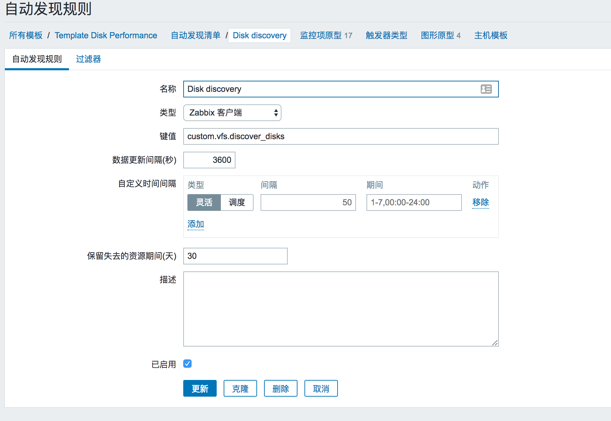
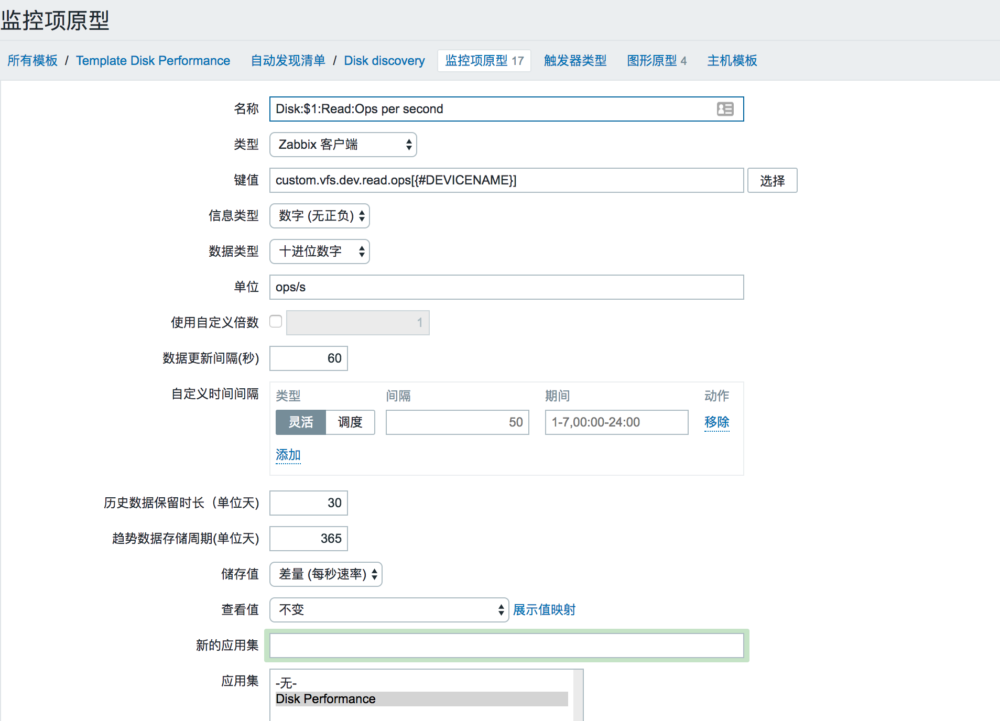
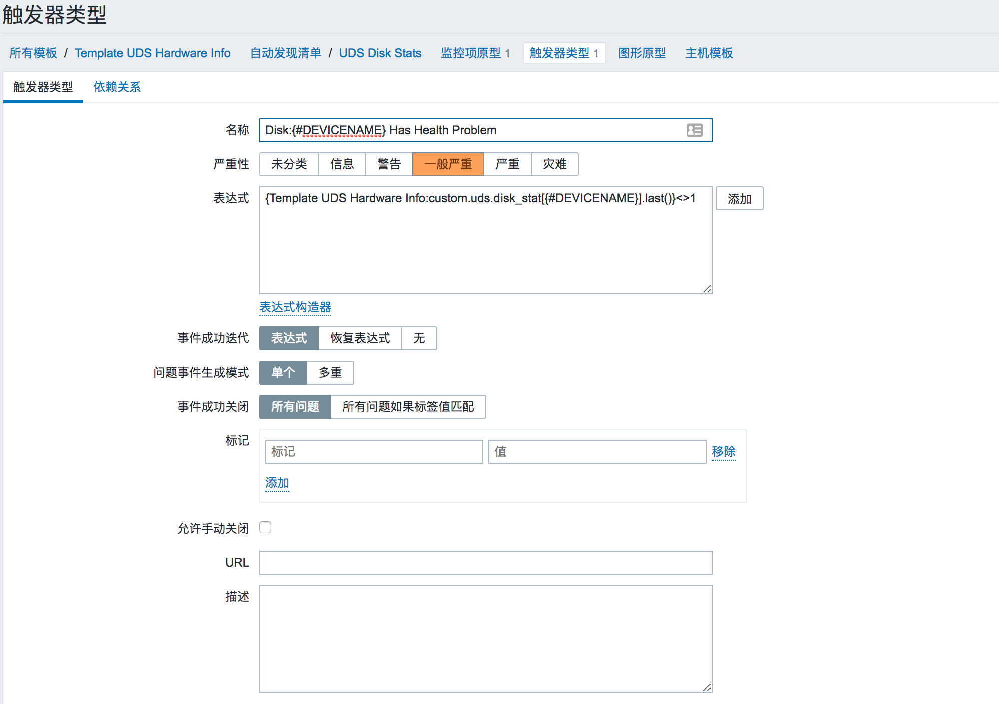

# 配置

## 搭建

## 从模板部署监控

## 邮件与短信报警

# 优化

## zabbix server配置优化

## mysql优化

## zabbix agent优化

## zabbix proxy

# 自定义监控

## 自带监控

* 监控端口net.tcp.port[,PORT_NUMBER]

    [root@Zabbix_Server ~]# /app/zabbix/bin/zabbix_get -s 10.10.2.32 -k net.tcp.port[,21]
    1
    返回1表示端口存在

* 监控进程 proc.num[process_name]

    [root@Zabbix_Server ~]# /app/zabbix/bin/zabbix_get -s 10.10.2.131 -k proc.num[mysqld]
    1
    返回进程数量

* 监控CPU核数 system.cpu.num

    [root@Zabbix_Server ~]# /app/zabbix/bin/zabbix_get -s 10.10.2.32 -k system.cpu.num
    16

* 查看文件的大小 vfs.file.size[file] 单位是bytes

    [root@Zabbix_Server ~]# /app/zabbix/bin/zabbix_get -s 10.15.44.161 -k vfs.file.size[/var/log/zabbix.log]
    另外还可以查看文件是否存在，计算文件MD5


## 自定义监控

## 自定义discovery监控

需要在agent配置里允许自定义监控

    UnsafeUserParameters=1

自定义变量

    # cat userparameters.conf
    UserParameter=key[*],command

key为唯一值，[*]表示参数，允许有多个参数，command为要执行的命令或脚本

key的[*]里面的参数一一对应command的$1到$9，一共9个参数。$0表示脚本命令。返回结果数据最大为512KB。

如果需要使用命令行里面出现$2这种变量，那么你要使用两个$$2，例如awk ’{ print $$2 }’

```
root@njA-m02-mon-01:/etc/zabbix/zabbix_agentd.d# cat userparameter_diskstats.conf
UserParameter=custom.vfs.discover_disks,/opt/lld-disks.py

UserParameter=custom.vfs.dev.read.ops[*],awk '{print $$1}' /sys/class/block/$1/stat
UserParameter=custom.vfs.dev.read.merged[*],awk '{print $$2}' /sys/class/block/$1/stat
```

将如上内容添加到zabbix server

先创建自动发现规则，key为custom.vfs.discover_disks

ldd-disks.py的输出格式如下

```
root@njA-m02-mon-01:/etc/zabbix/zabbix_agentd.d# /opt/lld-disks.py
{
    "data": [
        {
            "{#DEVICENAME}": "sda"
        },
        {
            "{#DEVICENAME}": "sdb"
        },
        {
            "{#DEVICENAME}": "sdc"
        },
	]
}
```

然后创建监控项原型,触发器原型，图形原型

监控项原型，键值为custom.vfs.dev.read.ops[{#DEVICENAME}]，名称可以为：Disk:$1:Read:Ops per second（其中$1即为#DEVICENAME的值）


触发器原型和图形原型，均需要先创建监控项原型


